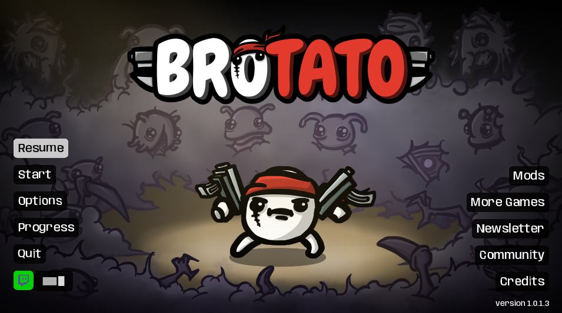

## Why?

Someone asked for an HTML person on the Brotato Discord to help out in building a Twitch overlay mod, and I'm kind of an HTML person, so I said I'll do it!

## How?

Very good question. I never built something with Twitch APIs before, so I struggled for some time before I managed to set everything up.

Luckily, I had help from Pasha, who had asked for the HTML person on Discord. He has some experience in that field for his [TwitchSlaysSpire](https://www.twitch.tv/twitchslaysspire) channel.

## Big Picture

At the end, we have three main components:

- Backend → Godot Brotato Mod
- Backend → Authentication serverless functions on Netlify
- Frontend → Svelte hosted on Twitch


I will skip over the authentication part, most of that was handled by Pasha, so I don’t have all the details.

## Backend - Godot Brotato Mod




All the user can see from the Mod are these two buttons on the main menu. One to login and one to toggle the data collection.  
In the background, a lot more is going on. I will focus on the _[pubsub_sender.gd](https://github.com/KANAjetzt/brotato-twitch-ebs/blob/feat_batching/mods-unpacked/Pasha-TwitchEBS/pubsub_sender.gd)._

### Pubsub Sender

**What even is pubsub?**

> [The Twitch PubSub system allows back-end services to broadcast realtime messages to clients.](https://dev.twitch.tv/docs/pubsub/)

So, in very short, it’s used to chat with basically everything.  
We will use it here to send all the game data we want to display on the overlay from the game on the local PC to Twitch where the overlay is hosted.

Let’s break down what happens inside _[pubsub_sender.gd](https://github.com/KANAjetzt/brotato-twitch-ebs/blob/feat_batching/mods-unpacked/Pasha-TwitchEBS/pubsub_sender.gd)._


- On a Game Data change, the corresponding "Data Handler" is called and adds data to the corresponding update queue. If that data requires an image upload, the upload image handler is called and adds the image data to the queue.
- The `SendTimer` calls the "Sender" every 3 seconds. The Sender decides to create an "Update Batch" or a "Catch Up Batch" and sends it to the Twitch Pubsub Endpoint.
  - An "Update Batch" contains new data from the update queues, new data is added to the catch-up stores.
  - A "Catch Up Batch" contains old data from the stores.


### The Data

Let's take a peek at what the overlay actually looks like.


<details open>
	<summary>
	👇 Here is one example batch of data that is sent to the Overlay 👇
	</summary>

```js
;[
  {
    id: '',
    action: 'stats_update',
    data: {
      stat_max_hp: 10,
      stat_armor: 0,
      stat_crit_chance: 0,
      stat_luck: 125,
      stat_attack_speed: 0,
      stat_elemental_damage: 0,
      stat_hp_regeneration: 0,
      stat_lifesteal: 0,
      stat_melee_damage: 0,
      stat_percent_damage: 0,
      stat_dodge: 0,
      stat_engineering: 0,
      stat_range: 0,
      stat_ranged_damage: 0,
      stat_speed: -1,
      stat_harvesting: 0,
      xp_gain: 0,
      number_of_enemies: 0,
      consumable_heal: 0,
      burning_cooldown_reduction: 0,
      burning_spread: 0,
      piercing: 0,
      piercing_damage: 0,
      pickup_range: 0,
      chance_double_gold: 0,
      bounce: 0,
      bounce_damage: 0,
      heal_when_pickup_gold: 0,
      item_box_gold: 15,
      knockback: 0,
      hp_cap: 999999,
      speed_cap: 999999,
      lose_hp_per_second: 0,
      map_size: 0,
      dodge_cap: 180,
      gold_drops: 100,
      enemy_health: 0,
      enemy_damage: 0,
      enemy_speed: 0,
      boss_strength: 0,
      explosion_size: 0,
      explosion_damage: 0,
      damage_against_bosses: 0,
      giant_crit_damage: 0,
      weapon_slot: 6,
      items_price: 50,
      harvesting_growth: 5,
      hit_protection: 0,
      weapons_price: 0,
      trees: 5,
      free_rerolls: 0
    }
  },
  {
    id: '84e6bc23-5907-49f3-905f-de53ef77b0bd',
    action: 'weapon_added',
    data: {
      id: 'weapon_kana_shovel_1',
      weapon_id: 'weapon_kana_shovel',
      tier: 0,
      name: 'Shovel',
      set: 'Blade, Primitive',
      stats:
        '[color=#ffeae2b0]Damage[/color]: [color=#00ff00]11[/color] [color=#555555]| 8[/color] ([img=20x20]res://items/stats/melee_damage.png[/img][color=white]3%[/color][img=20x20]res://items/stats/luck.png[/img])\n[color=#ffeae2b0]Critical[/color]: [color=white]x2[/color] ([color=white]3[/color]% chance)\n[color=#ffeae2b0]Cooldown[/color]: [color=white]1.28s[/color]\n[color=#ffeae2b0]Knockback[/color]: [color=white]5[/color]\n[color=#ffeae2b0]Range[/color]: [color=white]200[/color] (Melee)\nAlternates between thrusting and sweeping attacks',
      effects:
        'Small chance to drop a crate when an enemy dies\n[color=#ffeae2b0]Treasures dug up: 0[/color]'
    }
  },
  {
    id: 'ecbfa858-e9db-46be-b686-e6b748a41a52',
    action: 'item_added',
    data: {
      id: 'character_treasure_hunter',
      tier: 0,
      name: 'Treasure Hunter',
      effects:
        'You start with [color=#00ff00]5[/color] [color=#00ff00]Tree[/color]\nYou start with [color=#00ff00]1[/color] [color=#00ff00]Bag[/color]\nYou start with [color=#00ff00]1[/color] [color=#00ff00]Mysterious Medal[/color]\n[color=#00ff00]+50[/color] Luck\n[color=#00ff00]Luck[/color] modifications are increased by [color=#00ff00]25%[/color]\nGet [color=#00ff00]3[/color] [color=#00ff00]Max HP[/color] for each [color=#00ff00]Mysterious Skull[/color] collected\nGet [color=#00ff00]2[/color] [color=#00ff00]% Damage[/color] for each [color=#00ff00]Mysterious Skull[/color] collected\nGet [color=red]-3[/color] [color=red]% Speed[/color] for each [color=red]Mysterious Skull[/color] collected until the end of the wave\n[color=red]+50[/color] % Items Price\n[color=red]-65%[/color] materials dropped from enemies\n[color=#ffff0000]You can’t heal in any way[/color]\n[color=#ffeae2b0]Treasures collected: 0[/color]',
      count: 1
    }
  },
  {
    id: 'c7403b2f-2c58-41db-897d-794d05520c4e',
    action: 'item_added',
    data: {
      id: 'item_tree',
      tier: 0,
      name: 'Tree',
      effects: 'More trees spawn\n[color=#ffeae2b0][/color]',
      count: 5
    }
  },
  {
    id: '6690b93c-7167-4a13-a10e-a505b964d988',
    action: 'item_added',
    data: {
      id: 'item_bag',
      tier: 0,
      name: 'Bag',
      effects:
        '[color=#00ff00]+15[/color] materials when you pick up a crate\n[color=red]-1[/color] % Speed\n[color=#ffeae2b0]Materials gained: 0[/color]',
      count: 1
    }
  }
]
```

</details>

So each type of data is associated with an "action." This action defines what to do with the data. More on that later.

Currently, these are all the actions needed:

```php
var send_action_strings := {
	0: "clear_all",
	1: "stats_update",
	2: "weapon_added",
	3: "weapon_removed",
	4: "item_added",
	5: "image_upload",
}
```

### Image Upload

All vanilla images are added directly to the frontend and picked based on the item and weapon ID.


But there exist a lot of cool mods for Brotato, and most of them have their own unique icons. The Blobfish is nice but wasn’t to my full satisfaction. That’s why the Image Upload block exists up there in the overview. I decided to squeeze these 96x96 images over the PubSub wire via base64 string. Here is how this works:

- Check if the image has been uploaded before with `is_image_processed()`.
- If not, create the base64 string from the `Image` Resource.
  ```php
  var base64 := Marshalls.raw_to_base64(image.save_png_to_buffer())
  ```
- Split that string into chunks. I decided to go with 3500 chars per chunk, leaving a bit of space for the 4 kb limit, just to be safe.
- Add that image data to the queue, so it is sent by the “Sender".
  
  
- The “Sender" picks a chunk of image from the `update_queue_image` and adds it to the next update batch.

Here is what an `image_upload` action looks like:

```json
{
  "id": "3f4944b2-b539-4c38-8ecc-a9bfa35e0fac",
  "action": "image_upload",
  "data": {
    "item_id": "weapon_kana_shovel",
    "base64_chunk": "iVBORw0KGgoAAAANSUhEUgAAAGAAAABgCAYAAADimHc4AAAAAXNSR0IArs4c6QAAFqNJREFUeJztnVlwZNd533/n3Ht7RXcDjR0NoLHODE1yuJujhBQtyy4nkeW3JE4qD5ZL8la249jlch786JdUEklOqhKlsvkllaTspFyWLcsmGVkamlYNRVLS0OTsAwx2dKP35fbdTh5Odw8wmAVDzoYe/KtQAGZuo8/9/7/7ne985/tOwxGOcIQjHOEIR3goMB72AA4BLCAMiF1fqv39E+Oe/JEeQhgIgHnABI6jORoAKmgxrgIt4DLagHfa17of5w2PBACJJn0SyAIngVeBYSFERikVlVI6QRBEpJR2EAQloAT8LdAEfghcA9bav3cEcQ7y5o+7ACawgLb4nwKmgc8ahuFblpUKh8MkEgnq9TrJZJJKpYLneXie12y1WiaQC4IgBHwfKAKXgC3gG2hhz99pAI+rABLtbj4HHAP+mWEYw77vpyczGRkKh5mfnyfR10c2m6XRaJBKpVhZWcG2bYqlEs1mkwsXLxAOhcnn856U0nddtwZElFJvAx8BXwfeuN1AHkcBJtCu4l+iBUinUqkx0zTFU08+yczMDMPDw6TTaSzLQgiBZZq4ros0DFqtFp7n4Xse27kc5XKZzc1NCoUC9UaDUqmoqtWaaDab59Hu6b8Df36rwTxuAryK9vE/LqV8TUoZn5qaikxOTjI3O8vc7BymZRKLRvGDALhOkAKE0L8JIVBKYUhJo9nEkJJqrYbnuly8dJHzFy5y5coVGo3GZeA08N/a3/fBvM83/CjAQPP4aeAfA6fC4fBTkUiEEydOyJdefJF4PE5mYgLX9RBCdMkHTXz3Z6X2fPd8n3A4DEA6nQalSCaT+IGiXC7juu6867oN9BOQREdSe9DrAsSBfuDHgH8IHEulUk8sLiwwPDLCqZdfJhqNYpkmnuehUF1yD4rdogghEIbByMgIQ0ND1Ot1SqXSjwRB8BPAX3J9DdFFLwvQB0yhrf4XhRAilUqNvvzyy8zNzjI7M4OUEiHkHov/pIiEw4TDYVKpFLFYjFKpFACzaNe3zw31qgAJdEz/T4HfSSQSKpVKGc8+8wyLi4tMTU6BgCAIUNydxd8OSilc1yVkWcRiMVKpFPl83rJtexRt+Qbg7X5NLwqQAOaAnwV+e3h4WE5PTfHcc88xNjpKOp1u+3n/vry5aZqYpqndkZ6sFTAIvISOisp7rr8vo3h46EM/7j8L/NbIyIgxOzvLq6+8wvjYGKKdyblf5IN+qizLIhwKEY/HSaVSYnt7exgYRa899kDet5E8eETRPv8fAb85MjJizc7O8ulXX2VyclLPfgqC4N65nFvB932EEJimiWVZGIYhgU+h3eIe9JIABvB5tOWHZrJZXn3lFTKZDL7vE8CBvf3ueP9uIaXE8zyato1lWSSTSQzDMNDeRnHDU9BLAjwFfC4aiRqDg4N8+rXXmJqcwvf9A4eWQgiklNi2TbVapdFo3LUInufhBwGGYSClxLIsIpFIIISYBV5AZ1K76JU5IAmMAbFQOGQ9c/KkGhocFJ3Y/iDokJ/L5SiVSpw9e5ZkMsmpU6eIxWIHFtE0TRzHoVqtIqUkFothGIZUSglgCJ0KWe9ef9e3+miiApwUQpwcHRlRAwMDwjTNmyx7bg4pJVJKzp8/z8bGBj88e5aNjQ2eeOIJdnZ2iEajBxqEEIJWq4XrukQiERxHZ6TD4TBSytEgCBYAn10j6xUB5tpfDYToHxgYwDAMfP/O0U7H8t977z3ee/99tre3u6Qnk0lGx8a6uZ+DQAhBs9HAcRyEEESjUSKRCEIIBx2l9QPbnet7QQABNADLsqxEOp3GNAw4QLQjhMAwDM688w5vv/02hZ0dWo5Dqr+fxfl5XnrpJR063QUajQa2be+ZOzprAvQEbO2+vhcEAIgAphDCAwxpGHd0Px3Lf+edd3jrrbfY2dlBKcX4+DjZmRmee+YZkokEkUiEIAi6JLZaLULhMOoW6QvHcWg0m93XKKXQQRAh9ARcYNfoeiEKUu2vmud5rWq1iuf5t41eOmR+73vf4/Tp0xR2dhBCkM1mOba4yMmnniKdTtPX10fQJtowDD46d47v/+AHlEqlfX9fCIHruhSLRXzP675HEAQ0m02UUg0032n0FijQO0/AGrCklAoVCgV1+cplkUolkVLu890dy3/33Xc5/dZbFIpFaJOfyWTIZrOk02kSicQe8s+cOcPbb7+NFQphN5ucOnWKUCi0Jxvqui4tx6HlON1/t20b13VRSsXQ0c+F3ePphScAtF/9syAI/rpcLotioUC1UtUp4l0XdSfc99/nO6dPUygUUEqRzWaZmJhgtJ1GTiaTXfKllHz44Ye888475Hd2KBaLxOPxPeuLjrXX6nV2dnb2/Jvv+9RqNYIgWEZXUvTvHnivCNAEbOBis9nceve991hZWcFzXVAguL6yvXT5MmfOnKFQKBAEAdPT00xmMoyPjTExMcFgOt0lVkrJ5uYmS0tLFEslgiBgMpMhkUgQi8X2rJhbrRal9jWdvQHHcSgWi3ie13GTV4D87oH3igAAHwKvK6UahUKh/sabb3LlylV",
    "base64_chunk_index": 0,
    "base64_chunk_count": 3
  }
}
```

With this setup the strings can be pieced together based on there index and we have a complete image upload process!


## Catch Up

One issue someone has to solve if someone only sends part of a state to all clients is the fact that all clients that join late to the party missed out on the first batches of data. To solve this, all of the orange part exists up there in the overview.


<details>
	<summary>
	Codeblock
	</summary>

```php
var catch_up_store_weapons := {}
var catch_up_store_items := {}
var catch_up_store_stats := {}
var catch_up_store_images := {}
var catch_up_store_images_current_id := ''

var catch_up_index := 0
var catch_up_index_image := 0
var catch_up_index_image_chunk := 0

var is_catch_up := false
var is_catch_up_image := false
```

</details>

Each time a chunk of data is sent by the Sender, it is stored in one of the `catch_up_stores`. Each of the stores is based on the `item_id`. My first go was one store array with all actions, but that slowed the catch-up down to a crawl. Adding and removing weapons just to add new ones again is hardly optimized. 😄 With the current solution, each batch of `catch_up` data is valuable no duplicates, no adding, and removing.


Because each image chunk takes up an entire update, so 3 seconds, I came up with this flow for the Sender. Before the Sender fills the batch of data to send, it decides if it is an update or a catch-up. If it is a catch-up, it decides again to send image data or item, stats, and weapon data. With that, the priority is always on the current data, and the pubsub pipe is not clogged up with image chunks.

## Building the Overlay


Here is the final product again. Nothing too crazy, just 3 panels, tooltips, and some buttons.  
The process of actually getting it to run on Twitch as an overlay did take some tinkering.

[Extensions](https://dev.twitch.tv/docs/extensions/#build-your-first-extension)

I followed the "build your first extension" part of the Twitch docs; they do a decent enough job of explaining the basic setup. So, at the end, I had a new Extension in my Development Console Dashboard and was ready to start.

### Svelte

I had to figure out how to make things work with Svelte. Luckily, someone else had built a small extension in Svelte before, so I had something to get _inspiration_ from.

[Deep Rock Galactic Loadouts Twitch Extension](https://github.com/ajzbc/drg-loadout-twitch-extension)

In the end, you want to have an HTML file as an entry point or, depending on your type of extension, multiple. With the `input` option, it's possible to define those in the Vite config.

- _vite.config.js_

  ```jsx
  // vite.config.js
  import { resolve } from 'path'
  import { defineConfig } from 'vite'
  import { svelte } from '@sveltejs/vite-plugin-svelte'

  export default defineConfig({
    build: {
      rollupOptions: {
        input: {
          video_overlay: resolve('video_overlay.html'), // <-- thats the important bit
          config: resolve('config.html')
        }
      },
      assetsDir: 'app'
    },
    base: './',
    plugins: [svelte()]
  })
  ```

### SvelteKit

I switched to SvelteKit for a bit, just to allow me to spin up an endpoint for sending test data, so I don’t have to use pubsub all the time during development. In the end, I had to switch back to plain Svelte because I didn’t manage to get an export working without violating the content-security-policies. SvelteKit initializes with inline JS, and that is a no-go for Twitch Extensions. If you know how to get SvelteKit to not do this, please let me know 😶.

### Testing on Twitch

I don’t know why, but I was surprised to learn that I have to run an actual live stream even if I use the “local test” available on the extension dashboard. I think there is an option to do a non-public live stream, but I didn’t bother. Just know you will have to set up a stream to run a proper test for your extension if it is an overlay. With the livestream running and the extension activated, I found some issues. You can’t put any interactions in the bottom 20-30px because of the video player controls, and the open chat window overlaps the extension iframe for some reason, losing an additional 20-30px on the right. Nothing that can’t be fixed with a bit more padding. Also, I highly recommend building and uploading the extension during development a couple of times just to be sure everything works as expected; that is how I stumbled upon the content-security vs. SvelteKit issue.

### How things work on the Frontend


I will not go into great detail because most of the stuff is very basic.

### Receiving Data / Actions

To receive the pubsub messages from the backend, the Twitch JS helper is used. It is directly loaded from Twitch in the entry HTML file.

```html
<script src="https://extension-files.twitch.tv/helper/v1/twitch-ext.min.js"></script>
```

With that, it’s easy to listen to incoming messages like this:

```js
window.Twitch.ext.listen('broadcast', async (target, contentType, message) => {
  const data = JSON.parse(message)
  let new_game_data = data_handler(data)
  $game_data = new_game_data
})
```

### Data Handler

The Datahandler checks the `action` string and runs the corresponding handler function.

It also keeps the received `game_data` in memory and stores all `handled_actions` to check and possibly discard already received actions. In the end, it returns the new `game_data` that is stored in the [$game_data store](https://svelte.dev/docs/svelte-store). From this store, all components have access to the latest `game_data`.

### BB Code

Something a bit non-standard is the parsing of the BB Code used in the item and weapon effect / stat text. There are a couple of BB Code parsers out there, and I decided on [BBob](https://github.com/JiLiZART/BBob). Thankfully, with Svelte, it’s possible to just use the HTML renderer. It can parse all the BB Code used in Brotato. So we can just grab the full text string, send it through the parser, and output the raw HTML with `[@html](https://svelte.dev/docs/special-tags#html)`. Some strings have references to stat icons, so I use `replaceAll()` to replace references to `'res://items/stats’` with `stat_icons` to point them to the stat icons in the `static` directory. With that, it was quite easy to get the look and feel of the in-game UI for the tooltips.


### Animations

Nothing crazy here, so I'll just add some quick bullet points about the used animations.

- I used the **Animating height** example from this article to animate the height of the Item Panel.
  [Svelte and Spring Animations | CSS-Tricks](https://css-tricks.com/svelte-and-spring-animations/)
- Built-in transitions for the settings panel and tooltip.
  - [svelte/transition docs](https://svelte.dev/docs/svelte-transition)
- CSS animations to slide the panels in and out, because I didn’t want to remove them from the document.
  - [global.css - @keyframes](https://github.com/KANAjetzt/BrotatoTwitchExtension/blob/dd3da3f4c9e6078d50ef4940e23c592bbf110ae9/static/global.css#L445-L506) | [global.css - css var](https://github.com/KANAjetzt/BrotatoTwitchExtension/blob/dd3da3f4c9e6078d50ef4940e23c592bbf110ae9/static/global.css#L35)
  - [Container.svelte](https://github.com/KANAjetzt/BrotatoTwitchExtension/blob/dd3da3f4c9e6078d50ef4940e23c592bbf110ae9/src/Components/Container/Container.svelte#L115-L137)
- Used [svelte/animate](https://learn.svelte.dev/tutorial/animate) and a [keyed each block](https://svelte.dev/docs/logic-blocks#each) to animate the item sorting.
  - [Container_Items.svelte](https://github.com/KANAjetzt/BrotatoTwitchExtension/blob/dd3da3f4c9e6078d50ef4940e23c592bbf110ae9/src/Components/Container_Items/Container_Items.svelte#L88-L102)

## That's it!

If you have any questions, you can find me on the [Godot Modding Discord](https://discord.godotmodding.com/) and ping me in **#dev** or on Twitter [@KANAjetzt](https://twitter.com/KANAjetzt) 👍
