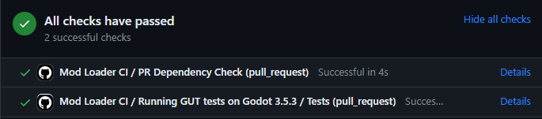
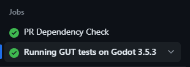
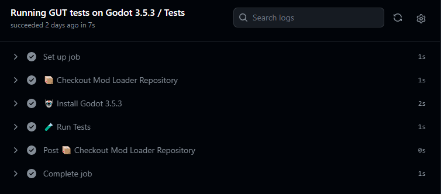

## Preamble

If you've come across this post, I assume you're already familiar with what a [GitHub Action](https://github.com/features/actions) is or [GUT](https://github.com/bitwes/Gut).

If not, here's a quick overview and some links for you. Feel free to skip this part if you already know your way around.

### GitHub Actions

- GitHub Actions allow you to run **actions** on specific events, for example, on PRs and commit pushes.
- These actions are defined using YAML files inside your GitHub Repo.
- GitHub Actions are hosted by GitHub, and you have access to [Ubuntu, Windows, and MacOS hosts](https://docs.github.com/en/actions/using-github-hosted-runners/about-github-hosted-runners/about-github-hosted-runners).
- [Here are the full Docs](https://docs.github.com/en/actions), but continue reading, I hope it will explain itself to some extent.

### GUT - Godot Unit Testing

- GUT is used to write unit and integration tests in Godot.
- What is a unit test?
  - Unit Tests test a unit of your code, most times a unit will be one function, and you will call a function with some input and check if you get the desired output.
- What is integration testing?
  - Integration testing simulates the actual usage of your software, instead of testing the individual component/functions. The input for integration tests, for example, is starting the game → opening the inventory and checking if the inventory is actually open. This allows you to check if all the individual parts of your program work together correctly.
- Why do you want to run tests?
  - Allows you to see if you broke a part of your program without touching it.
  - Simplifies Code Review (You don’t have to test every PR manually, or yolo merge).
  - You get a nice green checkmark each time your tests pass ✅

## What I Built

This will be a write-up of what I did for the Mod Loader Repo. So, this is not so much a follow-along tutorial but more like “look at what I did here”.


You can find my art on the [Godot Mod Loader Repo](https://github.com/GodotModding/godot-mod-loader/tree/main/.github/workflows).  
You can also speedrun this post and just look [at the PR](https://github.com/GodotModding/godot-mod-loader/pull/360) that includes all of this.  
Here is the structure I ended up with:

```
.github/
├── actions/
│   ├── godot-install/
│   │   └── action.yml
│   └── test/
│       └── action.yml
└── workflows/
    ├── main.yml
    └── tests.yml
```

In the following, I will (try) to explain what each of these files do.

## Tests Workflow

Let's dive right in, here is the full test workflow file.

<details open>
<summary>🔴 We are here → <code>.github/workflows/tests.yml</code></summary>

```yaml
# Inspired by https://github.com/bitbrain/beehave/blob/godot-4.x/.github/workflows/unit-tests.yml

name: tests
run-name: ${{ github.head_ref || github.ref_name }}-tests

on: # <-- This workflow is called `on` `workflow_call` or `workflow_dispatch`.
	workflow_call: # So this will be called by a different workflow file,
		inputs: # More on that later (it's the main.yml, yes).
			os: # <-- We do have 2 inputs here `os`
				required: false
				type: string
				default: 'ubuntu-22.04'
			godot-version: # <-- and `godot-version`, this can be passed with the
				required: true # `with` keyword from the "parent" workflow.
				type: string
				default: '3.5.3'

	workflow_dispatch:
		inputs:
			os:
				required: false
				type: string
				default: 'ubuntu-22.04'
			godot-version:
				required: true
				type: string

concurrency:
	group: tests-${{ github.head_ref || github.ref_name }}-${{ inputs.godot-version }}
	cancel-in-progress: true

jobs: # <-- Here we go, the job
	test:
		name: "Tests"
		runs-on: ${{ inputs.os }} # <-- We want to run this on Linux / Ubuntu
		timeout-minutes: 15 # <-- In the end, the test run will only take a few seconds

		steps: # <-- a job has steps
			- name: "📦 Checkout Mod Loader Repository"
				uses: actions/checkout@v4 # <-- Let's get the code that has been pushed
				with:
					lfs: true # <-- If your repo has big files you want that
					submodules: 'recursive' # <-- If your repo has submodules you want that

			- name: "🤖 Install Godot ${{ inputs.godot-version }}"
				uses: ./.github/actions/godot-install # <-- I will talk about that one
				with: # <-- here is the `with` keyword I was talking about
					godot-version: ${{ inputs.godot-version }} # <-- Remember these inputs
					godot-status-version: 'stable' # they get passed to the
					godot-bin-name: 'linux_headless.64' # godot-install action.
					godot-cache-path: '~/godot-linux'

			- name: "🧪 Run Tests"
				if: ${{ !cancelled() }} # <-- We check if the download failed here
				timeout-minutes: 4
				uses: ./.github/actions/test # <-- I will talk about that one
				with:
					godot-test-project: ${{ github.workspace }}/test # <-- This is where
					# The `checkout` action put the code
```

</details>

## **Get the Current Code of the PR**

🔴 `.github/workflows/tests.yml` `jobs: - steps: - actions/checkout@v4`

That’s the easiest part, we use the [checkout action](https://github.com/actions/checkout).

- `lfs: true` defines that we also want to clone [large files](https://docs.github.com/en/repositories/working-with-files/managing-large-files/about-git-large-file-storage).
- `submodules: 'recursive'` includes all submodules if you have any in your repo.

This will download all the code to `$GITHUB_WORKSPACE`, if we look at [the docs](https://docs.github.com/en/actions/learn-github-actions/variables#default-environment-variables), that should be here `/home/runner/work/my-repo-name/my-repo-name`.

## Godot Download Action

Here things can get a bit more involved.

I decided to take all inspiration from repos that did the download manually, but there is also [godot-action](https://github.com/paulloz/godot-action/tree/main) that might be the thing for you. I did not try it, so here is what I did.

<details open>
	<summary>
	🔴 We are here → <code>.github/actions/godot-install/action.yml</code>
	</summary>

```yaml
# Inspired by https://github.com/bitbrain/beehave/blob/godot-4.x/.github/actions/godot-install/action.yml

name: install-godot-binary
description: "Installs the Godot Runtime"

inputs: # <-- There are a couple of inputs we have to pass from `tests.yml`
	godot-version: # ${{ inputs.godot-version }} <- defaults to '3.5.3'
		description: "The Godot engine version"
		type: string
		required: true # <-- No default values here so we better pass these values 👀
	godot-status-version: # 'stable'
		description: "The Godot engine status version"
		type: string
		required: true
	godot-bin-name: # 'linux_headless.64'
		type: string
		required: true
	godot-cache-path: # '~/godot-linux'
		type: string
		required: true

runs: # <-- We are in a job already here
	using: composite
	steps:
		- name: "Set Cache Name" # <-- Creating this nice string `Linux-Godot_v3.5.3-stable`
			shell: bash # It is stored in the `CACHE_NAME` env var
			run: |
				echo "CACHE_NAME=${{ runner.OS }}-Godot_v${{ inputs.godot-version }}-${{ inputs.godot-status-version }}" >> "$GITHUB_ENV"

		- name: "Godot Cache Restore"
			uses: actions/cache/restore@v3 # <-- We try to restore cached files here
			id: godot-restore-cache
			with:
				path: ${{ inputs.godot-cache-path }} # <-- This is also the download path
				key: ${{ env.CACHE_NAME }} # <-- Here the cache name from above is used

		- name: "Download and Install Godot ${{ inputs.godot-version }}"
			if: steps.godot-restore-cache.outputs.cache-hit != 'true' # <-- no cache? Download
			continue-on-error: false # <-- If the download fails, the job fails
			shell: bash
			run: |
				mkdir -p ${{ inputs.godot-cache-path }} # <-- create the download/cache path
				chmod 770 ${{ inputs.godot-cache-path }} # <-- Set the right rights
				DIR="$HOME/.config/godot"
				if [ ! -d "$DIR" ]; then
					mkdir -p "$DIR"
					chmod 770 "$DIR"
				fi

				DOWNLOAD_URL=https://github.com/godotengine/godot/releases/download/${{ inputs.godot-version }}-${{ inputs.godot-status-version }}
				GODOT_BIN=Godot_v${{ inputs.godot-version }}-${{ inputs.godot-status-version }}_${{ inputs.godot-bin-name }}

				GODOT_PACKAGE=$GODOT_BIN.zip
				# 👇 Download the headless Linux Godot package from GitHub
				wget $DOWNLOAD_URL/$GODOT_PACKAGE -P ${{ inputs.godot-cache-path }}
				# 👇 Unzip the file
				unzip ${{ inputs.godot-cache-path }}/$GODOT_PACKAGE -d ${{ inputs.godot-cache-path }}

				# 👇 Rename the executable to `godot`
				mv ${{ inputs.godot-cache-path }}/$GODOT_BIN ${{ inputs.godot-cache-path }}/godot

				# 👇 Set the execution right for the executable
				chmod u+x ${{ inputs.godot-cache-path }}/godot
				# 👇 Print the path to the executable
				echo "${{ inputs.godot-cache-path }}/godot"

		- name: "Godot Cache Save"
			if: steps.godot-restore-cache.outputs.cache-hit != 'true' # <-- no cache?
			uses: actions/cache/save@v3 # <-- Then cache the downloaded files
			with:
				path: ${{ inputs.godot-cache-path }}
				key: ${{ steps.godot-restore-cache.outputs.cache-primary-key }}
```

</details>

### Passing `inputs` with `with`

At the top, we define the `inputs` for the download action. These `inputs` are passed to the action with the `with` property in the “parent” workflow file.

```yaml
with:
  godot-version: ${{ inputs.godot-version }}
  godot-status-version: 'stable'
  godot-bin-name: 'linux_headless.64'
  godot-cache-path: '~/godot-linux'
```

### Cache

Caching larger dependencies can speed up your actions tremendously, so it's worth the hassle to set up. The [cache action](https://github.com/actions/cache) is used for that, with a restore and save step.

Both will require a `key` and the `path` to the files.

[A key can be generated in many ways](https://github.com/actions/cache?tab=readme-ov-file#creating-a-cache-key), and for my use case, a simple `echo "some string"` is enough.

```yaml
- name: 'Set Cache Name'
  shell: bash
  run: |
    echo "CACHE_NAME=${{ runner.OS }}-Godot_v${{ inputs.godot-version }}-${{ inputs.godot-status-version }}" >> "$GITHUB_ENV"
```

### Cache - **Restore**

We call `actions/cache/restore@v3`, give it an `id`, and pass the `path` to the downloaded Godot file and the `key` that has been created. The cache action will check for cached files for this `key` now and return `cache-hit` as either `true` or `false`.

```yaml
- name: 'Godot Cache Restore'
  uses: actions/cache/restore@v3
  id: godot-restore-cache
  with:
    path: ${{ inputs.godot-cache-path }}
    key: ${{ env.CACHE_NAME }}
```

This can be accessed in the following steps by checking like this:

```yaml
if: steps.godot-restore-cache.outputs.cache-hit != 'true'
```

### Cache - **Save**

After the download step (that we have not yet talked about), we can store these files with `actions/cache/save@v3`. I skip this step if we already have something cached and pass the same inputs as the restore action gets.

```yaml
- name: 'Godot Cache Save'
  if: steps.godot-restore-cache.outputs.cache-hit != 'true'
  uses: actions/cache/save@v3
  with:
    path: ${{ inputs.godot-cache-path }}
    key: ${{ steps.godot-restore-cache.outputs.cache-primary-key }}
```

Nice, this will now restore the Godot download after it has been downloaded once, shaving off a couple of seconds from the action run time.


### The Actual Godot Download

Now, here it is. We start by checking if we have cached files with

```yaml
if: steps.godot-restore-cache.outputs.cache-hit != 'true'
```

and tell the action that things are bad if the download fails with

```yaml
continue-on-error: false
```

This will allow us to check if the run has failed with `${{ !cancelled() }}` later.

We have to tell the action what shell to use with `shell: bash` and continue to `run` the shell script.

Starting with the creation of all required directories and setting the right rights for them:

```bash
mkdir -p ${{ inputs.godot-cache-path }}
chmod 770 ${{ inputs.godot-cache-path }}
DIR="$HOME/.config/godot"
if [ ! -d "$DIR" ]; then
  mkdir -p "$DIR"
  chmod 770 "$DIR"
fi
```

We build some nice variables for the download link with the `inputs` we passed to the action:

```bash
DOWNLOAD_URL=https://github.com/godotengine/godot/releases/download/${{ inputs.godot-version }}-${{ inputs.godot-status-version }}
GODOT_BIN=Godot_v${{ inputs.godot-version }}-${{ inputs.godot-status-version }}_${{ inputs.godot-bin-name }}
GODOT_PACKAGE=$GODOT_BIN.zip
```

Next, the Godot executable is downloaded from GitHub with the created download link and unzipped. For Mod Loader, I download the 3.5.3 headless Linux version from `https://github.com/godotengine/godot/releases/download/3.5.3-stable/Godot_v3.5.3-stable_linux_headless.64.zip` .

```bash
wget $DOWNLOAD_URL/$GODOT_PACKAGE -P ${{ inputs.godot-cache-path }}
unzip ${{ inputs.godot-cache-path }}/$GODOT_PACKAGE -d ${{ inputs.godot-cache-path }}
```

Let’s rename the executable to make it easier to access later.

```bash
mv ${{ inputs.godot-cache-path }}/$GODOT_BIN ${{ inputs.godot-cache-path }}/godot
```

and set the execution right so we can actually run Godot later.

```bash
chmod u+x ${{ inputs.godot-cache-path }}/godot
```

At the end, we just print the path to the executable.

```bash
echo "${{ inputs.godot-cache-path }}/godot"
```

That's it! Now we can download or restore the Godot headless Linux executable and access it from `~/godot-linux/godot`.

## Testing Godot Project

Before we continue looking at the next action, let's take a quick detour on how I set up the tests for the [Mod Loader Repo](https://github.com/GodotModding/godot-mod-loader). I created a new Godot Project locally and added GUT from the Asset Lib, linking `mod_load` and `JSON_Schema_Validator`. I already had some unit tests written to test the Mod Manifest validation, and I added one to check if mods get sorted as they should. I will not go into how to write tests, there are a lot of good videos on YouTube, or just check out the [GUT Docs](https://github.com/bitwes/Gut/wiki).

Currently, I have two scripts to run tests:

```
test/
└── Unit/
    ├── test_manifest_validation.gd
    └── test_script_extension_sorting.gd

```

### GUT Config and CLI

To run GUT from the action, we use the CLI provided via `gut_cmdln.gd`. Check out the [CLI Docs](https://github.com/bitwes/Gut/wiki/Command-Line) for details. I took inspiration from the [fmod-gdextension](https://github.com/utopia-rise/fmod-gdextension/tree/godot-3.x). They added a [separate shell script](https://github.com/utopia-rise/fmod-gdextension/blob/godot-3.x/demo/run_tests.sh) at the root of the testing project. They do some fancy checking for `"failing asserts: 0”`, but that is not needed anymore. GUT will exit Godot and return an appropriate exit code depending on the test results. So my `run_tests.sh` is just one line:

```bash
$1 -d -s --path $PWD addons/gut/gut_cmdln.gd
```

I also copied the example `.gutconfig.json`, all I changed is the `"dirs"` array:

```json
{
  "dirs": ["res://Unit/"],
  "double_strategy": "partial",
  "ignore_pause": false,
  "include_subdirs": true,
  "inner_class": "",
  "log_level": 3,
  "opacity": 100,
  "prefix": "test_",
  "selected": "",
  "should_exit": true,
  "should_maximize": true,
  "suffix": ".gd",
  "tests": [],
  "unit_test_name": ""
}
```

To avoid duplicating the mod loader code in the repo or having a complete GUT installation in the diffs, I added all the addon stuff to a new `.gitignore` for the test project:

```
.import/
*.import
addons/

# Gut stuff in the root dir
asset_lib_icon.png
gut_panel.png
.gut_editor_shortcuts.cfg
BigFont.tres
BigFontTheme.tres
```

To also ignore the tests for asset lib downloads, we added them to the `.gitattributes`:

```
[...]

# Tests
test/                                   export-ignore

[...]
```

Now back to the GitHub Action!

## Run GUT Test Action

<details open>
	<summary>
	🔴 We are here → <code>.github/actions/test/action.yml</code> called from <code>github/workflows/tests.yml</code>
	</summary>

```yaml
# Inspired by <https://github.com/utopia-rise/fmod-gdextension/blob/godot-3.x/demo/run_tests.sh>

name: test
description: "Runs the tests via GUT CLI"

inputs: # <-- Some inputs again
	gut-download-path:
		required: true
		default: ~/gut_download # <-- But all have default values so I don't have to
	gut-addons-path: # pass anything from the workflow file.
		required: true
		default: ${{ github.workspace }}/test/addons/gut
	godot-test-project:
		required: true
		default: ${{ github.workspace }}/test

runs:
	using: composite

	steps:
		- name: "Set Cache Name" # <-- We generate a simple cache key again
			shell: bash
			run: |
				echo "CACHE_NAME_GUT=GUT_v7.4.1" >> "$GITHUB_ENV" # <-- "Linux-GUT_v7.4.1"

		- name: "GUT Cache Restore"
			uses: actions/cache/restore@v3 # <-- Try to restore the GUT download from cache
			id: gut-restore-cache
			with:
				path: ${{ inputs.gut-download-path }}
				key: ${{ runner.os }}-${{ env.CACHE_NAME_GUT }}

		- name: "Download GUT" # <-- Same process as for the Godot download
			if: steps.gut-restore-cache.outputs.cache-hit != 'true'
			continue-on-error: false
			shell: bash
			run: |
				mkdir -p ${{ inputs.gut-download-path }} # <-- Create dir for download files
				chmod 770 ${{ inputs.gut-download-path }} # <-- Set permissions

				# 👇 Get GUT from GitHub v7.4.1 for Godot 3.5
				wget <https://github.com/bitwes/Gut/archive/refs/tags/v7.4.1.zip> -P ${{ inputs.gut-download-path }}
				# 👇 Unzip it to the location where we will link it from later from.
				unzip ${{ inputs.gut-download-path }}/v7.4.1.zip -d ${{ inputs.gut-download-path }}/unzip

		- name: "GUT Cache Save" # <-- Save cache if there is none
			if: steps.gut-restore-cache.outputs.cache-hit != 'true' # We know the drill
			uses: actions/cache/save@v3 # by now 👍
			with:
				path: ${{ inputs.gut-download-path }}
				key: ${{ steps.gut-restore-cache.outputs.cache-primary-key }}

		- name: "Create addons Directory"
			if: ${{ !cancelled() }}
			shell: bash
			run: mkdir -p ${{ github.workspace }}/test/addons # <-- Create the addons dir

		- name: "⚔ Link GUT" # <-- Sim Link GUT from the download / cache path
			if: ${{ !cancelled() }}
			shell: bash
			run: ln -s ${{ inputs.gut-download-path }}/unzip/Gut-7.4.1/addons/gut ${{ github.workspace }}/test/addons/gut

		- name: "⚔ Link Mod Loader" # <-- Sim Link Mod Loader
			if: ${{ !cancelled() }}
			shell: bash
			run: ln -s ${{ github.workspace }}/addons/mod_loader ${{ github.workspace }}/test/addons/mod_loader

		- name: "⚔ Link JSON_Schema_Validator" # <-- Sim Link the JSON Schema Validator
			if: ${{ !cancelled() }}
			shell: bash
			run: ln -s ${{ github.workspace }}/addons/JSON_Schema_Validator ${{ github.workspace }}/test/addons/JSON_Schema_Validator

		- name: "Run Tests" # <-- And run the tests 🎉
			if: ${{ runner.OS == 'Linux'}} && ${{ !cancelled() }}
			env:
				TEST_PROJECT: ${{ inputs.godot-test-project }}
			shell: bash
			run: |
				cd "${TEST_PROJECT}" # <-- cd into the test project, just to be sure.
				chmod +x run_tests.sh # <-- set execution rights.
				./run_tests.sh "$HOME/godot-linux/godot" # <-- call the shell script, with the
																									# Godot executable path as argument.
																									# The argument is `$1` in the .sh script.

```

</details>

Most of what is happening in this action has already been covered, so just a quick overview:

1. We generate the cache key → `Linux-GUT_v7.4.1`.
2. `actions/cache/restore@v3` tries to restore files with this key.
3. If there is no cache, GUT is downloaded from GitHub and stored in `${{ inputs.gut-download-path }}` and unzipped to `${{ inputs.gut-download-path }}/unzip`.
4. `actions/cache/save@v3` saves the downloaded GUT files if there is no cache yet.
5. The `addons` dir is created in the test project; remember `${{ github.workspace }}` is where `actions/checkout@v4` put the pushed code in the beginning.
6. GUT, Mod Loader, and JSON Schema Validator are linked into the `addons` dir.
7. `run_tests.sh` is called and [runs all the tests using the GUT CLI](#gut-config-and-cli).

Nice, almost done!

## Main Workflow

At the moment, all this hard work is never executed. To instruct GitHub to run all these tasks on a PR and if new code has been pushed, I use the `main.yml` workflow.

<details open>
	<summary>
	🔴 We are here → <code>.github/workflows/main.yml</code>
	</summary>

```yaml
# Inspired by https://github.com/bitbrain/beehave/blob/godot-4.x/.github/workflows/beehave-ci.yml

name: Mod Loader CI

on:
	push: # <-- We want to run the `jobs` on `push`
		paths-ignore:
			- '**.jpg'
			- '**.png'
			- '**.svg'
			- '**.md'
			- '**plugin.cfg'
	pull_request: # and if a new PR is created.
		paths-ignore:
			- '**.jpg'
			- '**.png'
			- '**.svg'
			- '**.md'
			- '**plugin.cfg'

concurrency:
	group: ${{ github.workflow }}-${{ github.ref }}
	cancel-in-progress: true

jobs:
	check_dependencies: # <-- We use the dependencies-action to check if a PR depends
		runs-on: ubuntu-latest # on a different PR.
		name: PR Dependency Check
		steps:
		- uses: gregsdennis/dependencies-action@main
			env:
				GITHUB_TOKEN: ${{ secrets.GITHUB_TOKEN }}
	tests: # <-- Here is all the hard work
		name: "Running GUT tests on Godot 3.5.3"
		uses: ./.github/workflows/tests.yml # <-- this will run the tests workflow
		with:
			godot-version: '3.5.3'

```

</details>

The `tests.yml` workflow is defined to run `on:` `workflow_call` and `workflow_dispatch`.

```yaml
on:
  workflow_call: [...]

  workflow_dispatch: [...]
```

So we tell GitHub in the `main.yml` to run the `tests.yml` workflow `on:`

```yaml
on:
  push: [...]
  pull_request: [...]
```

Now we just add the call to action in the `jobs:` section:

```yaml
tests:
  name: 'Running GUT tests on Godot 3.5.3'
  uses: ./.github/workflows/tests.yml
  with:
    godot-version: '3.5.3'
```

And there we go 🎉

A complete workflow to download Godot, GUT, and run tests.

## Local Development - Act It Out

The best way to get a general idea of whether your GitHub Action is working is with [act](https://github.com/nektos/act).

[act](https://github.com/nektos/act) allows you to run your actions on your machine, so you don’t have to spam commits to test if the basics are working. I’m on Windows and already had [WSL](https://learn.microsoft.com/en-us/windows/wsl/install) set up. So, I just downloaded [Docker](https://www.docker.com/products/docker-desktop/) and was up and running. (Not really, my last BIOS update reset CPU virtualization, so I got some errors to decipher). I used [this blog post](https://medium.com/@debasishkumardas5/running-github-actions-locally-a-complete-guide-for-windows-mac-and-linux-users-34c45999c7cd) to guide me through the [act](https://github.com/nektos/act) installation.

With [act](https://github.com/nektos/act) set up, I can simulate the `push` action, and it will run the `main.yml`.

All I have to do is run `act push` and watch it go 👀

Be prepared to see things crash and burn. It's really easy to mess up some indentation in a `.yml` file, but if I can get it working, you can too 💪

You'll most likely also find out that [act](https://github.com/nektos/act) can’t simulate the live environment of the action one-to-one. For example, the `$HOME` or `~` will point at a different path in production. So make sure not to hard code paths to `home`.


## Conclusion

So that was a walk in the park, right?

Quick Recap:

- 2 actions [`godot-install`](#godot-download-action) and [`test`](#run-gut-test-action)
- called by the [`test.yml` workflow](#tests-workflow)
- that is called in the [`main.yml` workflow](#main-workflow)
- the [`main` workflow](#main-workflow) is run `on:` `push` and `pull_request`
- [We run this locally with act](#local-development---act-it-out)

### And done!





This is obviously just the first working implementation. I expect this workflow will get some more polish with time, but I think this is a solid start.

## TY

Big thanks to Miguel for [this great talk](https://youtu.be/blJCgrBepj4?si=v33McaHpgD8CkmHO) and the help on [his Discord](https://discord.gg/sJjsksEwDq).

Most of the stuff I borrowed from here:

[https://github.com/bitbrain/beehave](https://github.com/bitbrain/beehave)

[https://github.com/bitbrain/pandora](https://github.com/bitbrain/pandora)

[https://github.com/utopia-rise/fmod-gdextension](https://github.com/utopia-rise/fmod-gdextension)

If you have any trouble setting thing up, you can find me on the [Godot Modding Discord](https://discord.godotmodding.com/) and ping me in **#dev** 👍
