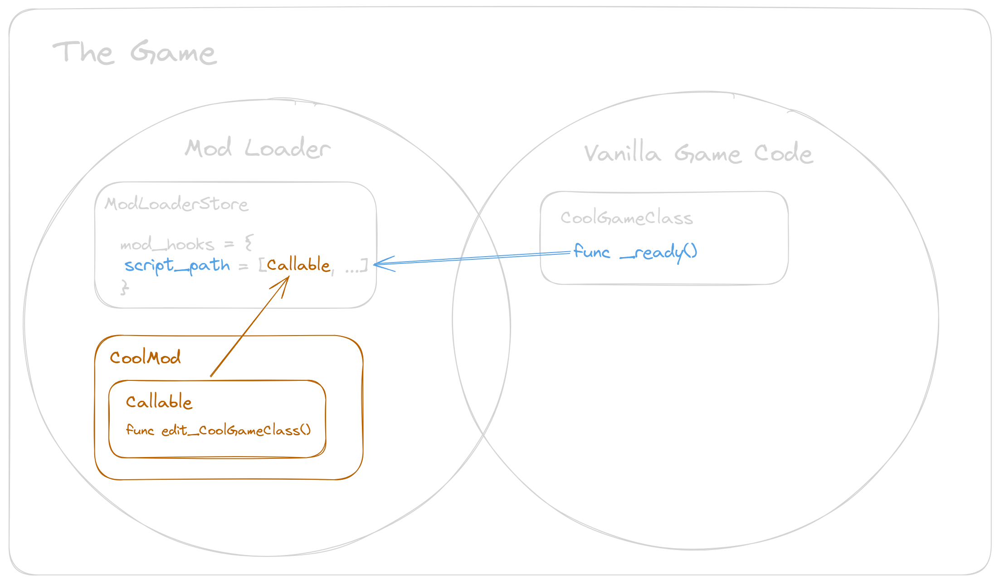
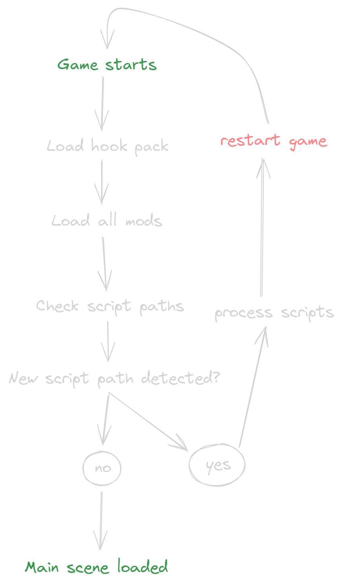
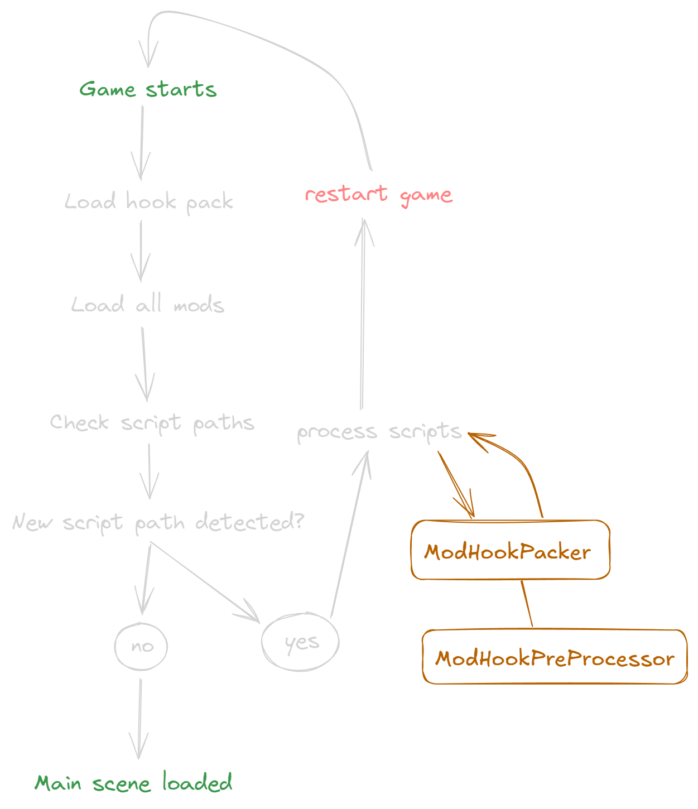

## Modding in Godot

The [Godot Documentation](https://docs.godotengine.org/en/stable/tutorials/export/exporting_pcks.html) will tell you about [`ProjectSettings.load_resource_pack()`](https://docs.godotengine.org/en/stable/classes/class_projectsettings.html#class-projectsettings-method-load-resource-pack) if you search for mod support. This is the foundation any mod system is build upon. But on it’s own it will not take you very far. Early you will discover pain points like “how do modders create there mods”, “how do they export them for distribution” and so on. That’s why we started building a package for any game dev or modder to make this process as painless as possible because we love modding and removing friction is the best way to enable as many people as possible to have part in it :)

## Modding in Godot 3

The [GodotModding](https://github.com/GodotModding) Project started with the release of [Dome Kepper](https://store.steampowered.com/app/1637320/Dome_Keeper/) and [Brotato](https://store.steampowered.com/app/1942280/Brotato/) at the end of 2022 beginning of 2023. For reference Godot 4 released in March 2023. From this 2 communities a small team formed to build a system that would allow to load multiple mods with as much compatibility as possible. Previously mods in Brotato simple distributed the full .pck of the game to players. That had the charm that the modder could simple go ham in the edtior and export the changes as if it was there own game. But I think it’s pretty clear where all the issues are with that solution. Dome Keepers had a more sensible approach, probably because the .pck size of the base game is 10x the size of brotatos. The early Dome Keeper mod loader loaded .pck files that included full game scripts that got replaced, limiting the compatibility with other mods greatly.

Outside of the FOV of these two communities a smart dev did the hard brain work for us. They solved most of the mentioned pain points with a bit of a mindbender and something the GDScript devs themselves haven't intended. In the [ΔV: Rings of Saturn](https://store.steampowered.com/app/846030/DV_Rings_of_Saturn/) community [Vladimir Panteleev](https://cy.md/) developed the first Godot Modloader with [`take_over_path()`](https://docs.godotengine.org/en/stable/classes/class_resource.html#class-resource-method-take-over-path) as the second central peace in the modding puzzle. They go into great detail on how this works in [this Blogpost](https://blog.cy.md/2022/05/27/modding-for-godot/).

So fast forward a couple of months and we released [the first version](https://github.com/GodotModding/godot-mod-loader/releases/tag/v3.0.0) of the [Godot GDScript Mod Loader](https://github.com/GodotModding/godot-mod-loader) and it got integrated into Dome Keeper and Brotato.

## Modding in Godot 4

Now with the release of Godot 4 and later the port of Dome Kepper to the new Engine version the interest in porting the Mod Loader to the new version grew. After all the chores of converting a project we hit a major road block. One of the pillars of our Godot 3 modding solution was ripped out. [`take_over_path()`](https://docs.godotengine.org/en/stable/classes/class_resource.html#class-resource-method-take-over-path) and script files no longer worked nicely together, at least if the scripts starts with a `class_name` . That put a hold on the porting process for quiet some time. We got in touch with the [GDScript team](https://godotengine.org/teams/) to discuss potential solutions and after that decided to wait for an engine level fix in Godot 4.3.


## Modding in Godot 4.3? 👀

Godot 4.3 released in August 2024 aaand there is no fix for the [`take_over_path()`](https://docs.godotengine.org/en/stable/classes/class_resource.html#class-resource-method-take-over-path) issue. Faced with that reality we decided to start working on alternative solutions.

### Brute force

At the end of the day mods need a way to execute there code at some point the vanilla game does something, for example calls a function. Now there are a couple of possible ways to allow that, especially if the creator of the vanilla script decides to support modding. One of them is to add a call to a potential function stored somewhere else, ideally at the beginning and the end of the vanilla function. With that we can basically restore the Godot 3 pattern of extending a script and overriding a function:

```php
# Godot 3 Code
extends "vanilla.gd"

func some_vanilla_func() -> void:
	.some_vanilla_func()
	[fancy mod code goes here]
```

In Godot 4 we got [first class functions](https://developer.mozilla.org/en-US/docs/Glossary/First-class_Function) and [Callables](https://docs.godotengine.org/en/stable/classes/class_callable.html) with that we build something like this:



That covers the basic need for _“mods need a way to execute there code at some point the vanilla game does something”_.

But most devs are not interested in writing something like:
```php
if ModLoaderStore.get("any_mod_hooked") and ModLoaderStore.any_mod_hooked:
		ModLoaderMod.call_hooks(self, [], 2777692791)
```

at the beginning and end of each function. Clearly some automation had be done.

### Export Plugin

[Export plugins](https://docs.godotengine.org/en/stable/classes/class_editorexportplugin.html) exist. They can be used to modify the export process to quote the docs here:

> [**EditorExportPlugin**](https://docs.godotengine.org/en/stable/classes/class_editorexportplugin.html)s are automatically invoked whenever the user exports the project. Their most common use is to determine what files are being included in the exported project.

So ez just write a little export plugin that adds a hook to each function.

Luckily there is [an example](https://github.com/dalexeev/gdscript-preprocessor) from dalexeev on how we can process scripts in an export plugin (for some reason that is not as intuitive as one might think, because [`_customize_resource()`](https://docs.godotengine.org/en/stable/classes/class_editorexportplugin.html#class-editorexportplugin-private-method-customize-resource) does nothing for scripts).

After a couple of days of tinkering we had something that was able to process all scripts in a project to add the necessary code. I explain how that process works in more detail later.

<details>
<summary>
Before processing
</summary>

```php
extends LevelBase

@onready var game_times: Node3D = %GameTimes

func _ready() -> void:
	super()
	Global.current_arena_index = level_data.level_id

	Global.game_won.connect(_on_game_won)
	Global.player.camera.tween_completed.connect(_on_player_camera_tween_completed)

func _on_portal_hit_detected(destination: LevelData) -> void:
	Global.player.is_input_disabled = true
	Global.blend()
	await get_tree().create_timer(0.1).timeout
	Global.player.teleport(destination.start_transform)
	Global.player.activate_particles()
	await get_tree().create_timer(0.1).timeout
	destination.ref.activate_camera()

func _on_game_won(first: bool) -> void:
	%PortalNewGame.deactivated = false
	if first and not Global.settings.gameplay_ui_show_level_timer:
		Global.settings.gameplay_ui_show_level_timer = true
	if first and not Global.settings.gameplay_ui_show_overall_timer:
		Global.settings.gameplay_ui_show_overall_timer = true

	game_times.get_child(-1).text = "%s | %s" % [game_times.get_child(-1).text, Global.score]
	add_time(Global.time_game)

func add_time(time: int) -> void:
	var new_label := Label3D.new()
	new_label.text = Global.hud.format_stopwatch(time)
	new_label.font_size = 900
	new_label.translate(Vector3(0, 4 * game_times.get_child_count(), -(4 * game_times.get_child_count())))
	game_times.add_child(new_label)

func update_time(time: int) -> void:
	game_times.get_child(-1).text = Global.hud.format_stopwatch(time)

func activate_camera() -> void:
	super()
	Global.time_game = Global.time_engine

func _on_player_camera_tween_completed() -> void:
	if Global.current_arena_index == 0:
		%PortalNewGame.deactivated = true
		Global.time_game_start = Global.time_engine
		level_data.level_time = 0
```

</details>


<details>
	<summary>
	After processing
	</summary>

```php
extends LevelBase

@onready var game_times: Node3D = %GameTimes

func vanilla_2924080498__ready() -> void:
	super._ready()
	Global.current_arena_index = level_data.level_id

	Global.game_won.connect(_on_game_won)
	Global.player.camera.tween_completed.connect(_on_player_camera_tween_completed)

func vanilla_2924080498__on_portal_hit_detected(destination: LevelData) -> void:
	Global.player.is_input_disabled = true
	Global.blend()
	await get_tree().create_timer(0.1).timeout
	Global.player.teleport(destination.start_transform)
	Global.player.activate_particles()
	await get_tree().create_timer(0.1).timeout
	destination.ref.activate_camera()

func vanilla_2924080498__on_game_won(first: bool) -> void:
	%PortalNewGame.deactivated = false
	if first and not Global.settings.gameplay_ui_show_level_timer:
		Global.settings.gameplay_ui_show_level_timer = true
	if first and not Global.settings.gameplay_ui_show_overall_timer:
		Global.settings.gameplay_ui_show_overall_timer = true

	game_times.get_child(-1).text = "%s | %s" % [game_times.get_child(-1).text, Global.score]
	add_time(Global.time_game)

func vanilla_2924080498_add_time(time: int) -> void:
	var new_label := Label3D.new()
	new_label.text = Global.hud.format_stopwatch(time)
	new_label.font_size = 900
	new_label.translate(Vector3(0, 4 * game_times.get_child_count(), -(4 * game_times.get_child_count())))
	game_times.add_child(new_label)

func vanilla_2924080498_update_time(time: int) -> void:
	game_times.get_child(-1).text = Global.hud.format_stopwatch(time)

func vanilla_2924080498_activate_camera() -> void:
	super.activate_camera()
	Global.time_game = Global.time_engine

func vanilla_2924080498__on_player_camera_tween_completed() -> void:
	if Global.current_arena_index == 0:
		%PortalNewGame.deactivated = true
		Global.time_game_start = Global.time_engine
		level_data.level_time = 0

# ModLoader Hooks - The following code has been automatically added by the Godot Mod Loader export plugin.

func _ready():
	if ModLoaderStore.get("any_mod_hooked") and ModLoaderStore.any_mod_hooked:
		ModLoaderMod.call_hooks(self, [], 2563180377)
	vanilla_2924080498__ready()
	if ModLoaderStore.get("any_mod_hooked") and ModLoaderStore.any_mod_hooked:
		ModLoaderMod.call_hooks(self, [], 2679547544)


func _on_portal_hit_detected(destination: LevelData):
	if ModLoaderStore.get("any_mod_hooked") and ModLoaderStore.any_mod_hooked:
		ModLoaderMod.call_hooks(self, [destination], 1506468663)
	vanilla_2924080498__on_portal_hit_detected(destination)
	if ModLoaderStore.get("any_mod_hooked") and ModLoaderStore.any_mod_hooked:
		ModLoaderMod.call_hooks(self, [destination], 3818880694)


func _on_game_won(first: bool):
	if ModLoaderStore.get("any_mod_hooked") and ModLoaderStore.any_mod_hooked:
		ModLoaderMod.call_hooks(self, [first], 2589280301)
	vanilla_2924080498__on_game_won(first)
	if ModLoaderStore.get("any_mod_hooked") and ModLoaderStore.any_mod_hooked:
		ModLoaderMod.call_hooks(self, [first], 3981843692)


func add_time(time: int):
	if ModLoaderStore.get("any_mod_hooked") and ModLoaderStore.any_mod_hooked:
		ModLoaderMod.call_hooks(self, [time], 3756891420)
	vanilla_2924080498_add_time(time)
	if ModLoaderStore.get("any_mod_hooked") and ModLoaderStore.any_mod_hooked:
		ModLoaderMod.call_hooks(self, [time], 3887075323)


func update_time(time: int):
	if ModLoaderStore.get("any_mod_hooked") and ModLoaderStore.any_mod_hooked:
		ModLoaderMod.call_hooks(self, [time], 2683732374)
	vanilla_2924080498_update_time(time)
	if ModLoaderStore.get("any_mod_hooked") and ModLoaderStore.any_mod_hooked:
		ModLoaderMod.call_hooks(self, [time], 730942773)


func activate_camera():
	if ModLoaderStore.get("any_mod_hooked") and ModLoaderStore.any_mod_hooked:
		ModLoaderMod.call_hooks(self, [], 1280247806)
	vanilla_2924080498_activate_camera()
	if ModLoaderStore.get("any_mod_hooked") and ModLoaderStore.any_mod_hooked:
		ModLoaderMod.call_hooks(self, [], 37660317)


func _on_player_camera_tween_completed():
	if ModLoaderStore.get("any_mod_hooked") and ModLoaderStore.any_mod_hooked:
		ModLoaderMod.call_hooks(self, [], 3347287027)
	vanilla_2924080498__on_player_camera_tween_completed()
	if ModLoaderStore.get("any_mod_hooked") and ModLoaderStore.any_mod_hooked:
		ModLoaderMod.call_hooks(self, [], 1011351538)

```
</details>


As you can see we decided to rename the vanilla functions and create imposters that include the calls to the mod Callables and additional logic we need.

### Performance

After applying this new found power to Dome Keeper, we hit some performance issues.

Turns out adding a little bit of code to each and all functions in a project has some performance implication. In terms of Dome Keeper it ended up with this:

> **Luca September 4, 2024 6:43 PM**
>
> in dome i have around 100.000 calls per sec to the Mod::call_hooks function

If we think about it, this can happen pretty quickly by adding 2 function calls to every process function in a project 😅

So preprocessing all scripts for a project the size of Dome Keeper is out of the question. But luckily Godot 4 has another new tool to help us.

### ZIPit

With the power of [ZIPPacker](https://docs.godotengine.org/en/stable/classes/class_zippacker.html) we can create a zip archive that only contains the processed scripts that are needed for the currently installed mods.

This results in the following steps:



Sadly we can’t create and load the hook pack in the same go. The Mod Loader does all the mod loading during `_init()` to allow the extension of autoloads. If we decide to ditch the `take_over_path` approach completely in the future we might be able to get rid of the required game restart. Processing scripts during `_init()` of the Mod Loader is not possible because we run into issues with variables declared with autoload props as defaults. These autoloads are not yet available at that point.

I think there is potential to make this work more seamless but this is it at the time of writing 😄 In general I want to note that this is the first iteration and I'm pretty sure we will find improvements in the near future.

### Dynamic Mod Hooks Pro and Cons

**Pro**
- Lower performance penalty
- If no mods are used scripts are not processed

**Cons**
- Only works for scripts that are not loaded at the point the resource pack is loaded, that means preloaded scripts can’t be hooked dynamically.
- Requires a game restart if new scripts need to be hooked

### Exported Mod Hooks Pro and Cons

**Pro**
- Works with scripts that are preloaded
- No game restart required

**Cons**
- Can cause performance issues on bigger games
  - _Performance penalty can be reduced by marking methods that are called often as `unmoddable`_
- Scripts are always processed
  - Might require additional testing for potential parse errors on export because of edge cases in scripts.
  - Small performance penalty even for player with no mods

## Mod API

Before we dive deep into the implementation of the preprocessor a quick lock at what the mod author needs know to use the hook system.

In Godot 3.5 mod authors used [`install_script_extension(child_script_path: String)`](https://wiki.godotmodding.com/#/api/ModLoaderMod?id=install_script_extension) to “register” modified scripts.

In Godot 4 this changes to `add_hook(mod_callable: Callable, script_path: String, method_name: String, is_before := false)`

So a very simple mod could look like this:

```php
# mod_main.gd

extends Node

func _init() -> void
	# Add extensions
	ModLoaderMod.add_hook(change_version, "res://game/Game.gd", "_ready", true)

func change_version(ref: Object, args: Array) -> void:
	ref.version = "1000.0"

```

- Each mod hook passes `self` and the args of the hooked function to the Callable. With that the mod author has the same access as with the 3.5 script extensions.
- In the example this is used to change the displayed version number in the title screen.

## ModHookPreProcessor

So know that we covered all the surface information, lets dive deeper into the two main components. Starting with the prepreocessor that is transforming the script to something moddable.

### Overview

Quick overview of what we have to do to transform a script:

- Replace all vanilla function names with something like `vanilla_2924080498__ready()`
- Replace all instances of `super()` with `super.vanilla_method_name()`
- Check if the function is a getter or setter
- Check if a function returns something and potential return types
- Get function parameters with and without types
- Handle function parameter defaults properly
- Check for inner classes
- Check if static or not
- Some additional configurations we added
  - Check if a function is marked as moddable or not moddalbe
- Create the imposter function with all the information collected

### Editing script with scripts

First you can take a full look at the Code in [this PR](https://github.com/GodotModding/godot-mod-loader/pull/408).

To access the plain source_code string of any script you can simple `load()` it and access the `source_code` property. From here on out you can do all the String magic you want, from strait up sending it through a full fledged GDScript parser to outer worldly Regexes.

We use three carefully handcrafted Regexes to get all the information we need.

```php
## finds function names used as setters and getters (excluding inline definitions)
## group 2 and 4 contain the xetter names
var regex_getter_setter := RegEx.create_from_string("(.*?[sg]et\\s*=\\s*)(\\w+)(\\g<1>)?(\\g<2>)?")

## finds every instance where super() is called
## returns only the super word, excluding the (, as match to make substitution easier
var regex_super_call := RegEx.create_from_string("\\bsuper(?=\\s*\\()")

## matches the indented function body
## needs to start from the : of a function definition to work (offset)
## the body of a function is every line that is empty or starts with an indent or comment
var regex_func_body := RegEx.create_from_string("(?smn)\\N*(\\n^(([\\t #]+\\N*)|$))*")
```

Additionally there are some handy reflection methods on the [Object](https://docs.godotengine.org/en/stable/classes/class_object.html#class-object) and [Script](https://docs.godotengine.org/en/stable/classes/class_script.html#methods) Class we can use to get some information about the content. We use [`get_script_method_list()`](https://docs.godotengine.org/en/stable/classes/class_script.html#class-script-method-get-script-method-list) and use it as much as possible. Sadly it does not provide all the information we need.

At the end once all the processing is done we return the modified string and use it in the export plugin to replace the original script in the exported game or pack it into a zip with `ZIPPacker`.

### Processing the script

If you look at the code the hard of the preprocessor is the `process_script(path: String)` function. Let’s go through it step by step:

```php
var current_script := load(path) as GDScript
var source_code := current_script.source_code
```

We load the script and get the `source_code` as described above.

```php
var source_code_additions := ""

	# We need to stop all vanilla methods from forming inheritance chains,
	# since the generated methods will fulfill inheritance requirements
	var class_prefix := str(hash(path))
	var method_store: Array[String] = []

```

`source_code_additions` this is where all the generated function imposters will go.

`class_prefix` hash of the script path used later to replace the function name

`method_store` stores the name of methods already processed, this is required because [`get_script_method_list()`](https://docs.godotengine.org/en/stable/classes/class_script.html#class-script-method-get-script-method-list) returns a full list of methods including inherited ones.

```php
var getters_setters := collect_getters_and_setters(source_code, regex_getter_setter)
```

```php
static func collect_getters_and_setters(text: String, regex_getter_setter: RegEx) -> Dictionary:
	var result := {}
	# a valid match has 2 or 4 groups, split into the method names and the rest of the line
	# (var example: set = )(example_setter)(, get = )(example_getter)
	# if things between the names are empty or commented, exclude them
	for mat in regex_getter_setter.search_all(text):
		if mat.get_string(1).is_empty() or mat.get_string(1).contains("#"):
			continue
		result[mat.get_string(2)] = null

		if mat.get_string(3).is_empty() or mat.get_string(3).contains("#"):
			continue
		result[mat.get_string(4)] = null

	return result
```

Storing all methods names of getters and setter. We don’t want to add imposters for them because it will cause an infinity loop.

<details>
<summary>
	Setter / Getter infinity loop
</summary>
<ul>
	<li>The setter is set to the mod hook</li>
	<li>That will call the vanilla function</li>
	<li>The vanilla function sets the var</li>
	<li>The setter is triggered again 🔁</li>
</ul>

```php
var some_var: set = _set_some_var

func vanilla_2924080498__set_some_var(new_value) -> void:
	some_var = new_value

func _set_some_var(new_value) -> void:
	if ModLoaderStore.get("any_mod_hooked") and ModLoaderStore.any_mod_hooked:
		ModLoaderMod.call_hooks(self, [new_value], 2563180377)
	vanilla_2924080498__set_some_var(new_value)
	if ModLoaderStore.get("any_mod_hooked") and ModLoaderStore.any_mod_hooked:
		ModLoaderMod.call_hooks(self, [new_value], 2679547544)
```

</details>

```php
var moddable_methods := current_script.get_script_method_list().filter(
		func is_func_moddable(method: Dictionary):
			if getters_setters.has(method.name):
				return false

			var method_first_line_start := get_index_at_method_start(method.name, source_code)
			if method_first_line_start == -1:
				return false

			if not is_func_marked_moddable(method_first_line_start, source_code):
				return false

			return true
	)
```

Combines all the checks if a function should be processed or not.

- Is it a setter or getter?
- Does the method exist in that script file?
- Check if the function is marked as `@not-moddable` or `@moddable`

```php
static func is_func_marked_moddable(method_start_idx, text) -> bool:
	var prevline := get_previous_line_to(text, method_start_idx)

	if prevline.contains("@not-moddable"):
		return false
	if not REQUIRE_EXPLICIT_ADDITION:
		return true

	return prevline.contains("@moddable")
```

  The preprocessor can be configured to only process functions that have a comment on top with `# @moddable` . `# @not-moddable` can be used to exclude functions, useful to skip `_process` functions for example.

```php
for method in moddable_methods:
		if method.name in method_store:
			continue
```

Now we start iterating over the filtered methods.

As described above we need to keep track if a method has already been processed because [`get_script_method_list()`](https://docs.godotengine.org/en/stable/classes/class_script.html#class-script-method-get-script-method-list) returns a full list of methods in the class including inheritance. Meaning if the current processed script overrides a function from a parent class that method will show up two times.

```php
var type_string := get_return_type_string(method.return)
```

`type_string` contains the return type of the function, so everything between `→` and `:`

```php
static func get_return_type_string(return_data: Dictionary) -> String:
	if return_data.type == 0:
		return ""
	var type_base: String
	if return_data.has("class_name") and not str(return_data.class_name).is_empty():
		type_base = str(return_data.class_name)
	else:
		type_base = type_string(return_data.type)

	var type_hint := "" if return_data.hint_string.is_empty() else ("[%s]" % return_data.hint_string)

	return "%s%s" % [type_base, type_hint]
```

It is a bit fiddly to construct the full string based on the data in the `return` dictionary we get in the method data. We have to take care of custom Class return types and type hints with Arrays (and Dictionaries in the future) for example `Array[String]`.

```php
var is_static := true if method.flags == METHOD_FLAG_STATIC + METHOD_FLAG_NORMAL else false
```

We can check the flags prop in the method data to figure out if a method is `static` or not.

```php
var method_arg_string_with_defaults_and_types := get_function_parameters(method.name, source_code, is_static)
```

`method_arg_string_with_defaults_and_types` contains everything between the opening `(` and closing `)` parenthesis. Sadly we can’t construct that string with the method data because everything that is passed as reference (Dictionaries / Arrays / ..) is not stored in the `default_args` prop of the method data. [It is possible that this will improve in the near future](https://github.com/godotengine/godot/issues/66218).

<details>
	<summary>
	<code>get_function_parameters()</code>
	</summary>

```php
static func get_function_parameters(method_name: String, text: String, is_static: bool, offset := 0) -> String:
	var result := match_func_with_whitespace(method_name, text, offset)
	if result == null:
		return ""

	if not is_top_level_func(text, result.get_start(), is_static):
		return get_function_parameters(method_name, text, is_static, result.get_end())

	# Find the index of the opening parenthesis
	var opening_paren_index := result.get_end() - 1
	if opening_paren_index == -1:
		return ""

	var closing_paren_index := get_closing_paren_index(opening_paren_index, text)
	if closing_paren_index == -1:
		return ""

	# Extract the substring between the parentheses
	var param_string := text.substr(opening_paren_index + 1, closing_paren_index - opening_paren_index - 1)

	# Clean whitespace characters (spaces, newlines, tabs)
	param_string = param_string.strip_edges()\
		.replace(" ", "")\
		.replace("\n", "")\
		.replace("\t", "")\
		.replace(",", ", ")\
		.replace(":", ": ")

	return param_string
```

  - <code>match_func_with_whitespace()</code> search the function via regex
  - Check if it is a top level function (not inside a inner class) - If it is call the <code>get_function_parameters()</code> function again with an offset to find the top level function we want.
  - The end index - 1 is the opening parenthesis

<details>
	<summary>
	<code>get_closing_paren_index()</code>
	</summary>

```php
static func get_closing_paren_index(opening_paren_index: int, text: String) -> int:
	# Use a stack to match parentheses
	var stack := []
	var closing_paren_index := opening_paren_index
	while closing_paren_index < text.length():
		var char := text[closing_paren_index]
		if char == '(':
			stack.push_back('(')
		elif char == ')':
			stack.pop_back()
			if stack.size() == 0:
				break
		closing_paren_index += 1

	# If the stack is not empty, that means there's no matching closing parenthesis
	if stack.size() != 0:
		return -1

    	return closing_paren_index
```

	Hunting for the last <code>)</code>

</details>

<ul>
<li>Get sub string between the parenthesis</li>
<li>Clean it up and <code>return</code> it</li>
</ul>
</details>


```php
var method_arg_string_names_only := get_function_arg_name_string(method.args)
```

`method_arg_string_names_only` is without any types and used to call the vanilla function

<details>
	<summary>
	<code>get_function_arg_name_string(method.args)</code>
	</summary>

  ```php
static func get_function_arg_name_string(args: Array) -> String:
	var arg_string := ""
	for x in args.size():
		if x == args.size() -1:
			arg_string += args[x].name
		else:
			arg_string += "%s, " % args[x].name

	return arg_string
  ```
	
	Nice and simple we can just take the use the `args` prop from the method data to construct the String we want.
</details>

```php
var hash_before := ModLoaderMod.get_hook_hash(path, method.name, true)
var hash_after := ModLoaderMod.get_hook_hash(path, method.name, false)
var hash_before_data := [path, method.name,true]
var hash_after_data := [path, method.name,false]
if hashmap.has(hash_before):
		push_error(HASH_COLLISION_ERROR%[hashmap[hash_before], hash_before_data])
if hashmap.has(hash_after):
		push_error(HASH_COLLISION_ERROR %[hashmap[hash_after], hash_after_data])
hashmap[hash_before] = hash_before_data
hashmap[hash_after] = hash_after_data
```

Lots of hashing going on. The mod callables are store in this format:

```php
var modding_hooks := {
 	1917482423: [Callable, Callable],
	3108290668: [Callable],
}
```

The hash allows use to “embed” the `script_path` and `before` and `after` information into one key.

<details>
	<summary>
	<code>get_hook_hash()</code>
	</summary>

	```php
static func get_hook_hash(path:String, method:String, is_before:bool) -> int:
	return hash(path + method + ("before" if is_before else "after"))
  ```
  Creates the hash that is used as the key of the dictionary.
  We use a hash to simplify the access to the Callables and improve the performance with it.

</details>

```php
var mod_loader_hook_string := get_mod_loader_hook(
	method.name,
	method_arg_string_names_only,
	method_arg_string_with_defaults_and_types,
	type_string,
	method.return.usage,
	is_static,
	path,
	hash_before,
	hash_after,
	METHOD_PREFIX + class_prefix,
)
```

`mod_loader_hook_string` contains the entire imposter function as a string

<details>
	<summary>
	<code>get_mod_loader_hook()</code>
	</summary>

	```php
static func get_mod_loader_hook(
	method_name: String,
	method_arg_string_names_only: String,
	method_arg_string_with_defaults_and_types: String,
	method_type: String,
	return_prop_usage: int,
	is_static: bool,
	script_path: String,
	hash_before:int,
	hash_after:int,
	method_prefix := METHOD_PREFIX
) -> String:
	var type_string := " -> %s" % method_type if not method_type.is_empty() else ""
	var static_string := "static " if is_static else ""
	# Cannot use "self" inside a static function.
	var self_string := "null" if is_static else "self"
	var return_var := "var %s = " % "return_var" if not method_type.is_empty() or return_prop_usage == 131072 else ""
	var method_return := "return %s" % "return_var" if not method_type.is_empty() or return_prop_usage == 131072 else ""

	return """
func ():
	if ModLoaderStore.get("any_mod_hooked") and ModLoaderStore.any_mod_hooked:
		ModLoaderMod.call_hooks(, [], )
	_()
	if ModLoaderStore.get("any_mod_hooked") and ModLoaderStore.any_mod_hooked:
		ModLoaderMod.call_hooks(, [], )
	""".format({
		"%METHOD_PREFIX%": method_prefix,
		"%METHOD_NAME%": method_name,
		"%METHOD_PARAMS%": method_arg_string_with_defaults_and_types,
		"%RETURN_TYPE_STRING%": type_string,
		"%METHOD_ARGS%": method_arg_string_names_only,
		"%SCRIPT_PATH%": script_path,
		"%METHOD_RETURN_VAR%": return_var,
		"%METHOD_RETURN%": method_return,
		"%STATIC%": static_string,
		"%SELF%": self_string,
		"%HOOK_ID_BEFORE%" : hash_before,
		"%HOOK_ID_AFTER%" : hash_after,
	})
  ```
	
	We use all the data we collected previously to fill out the template and toggle things like `static` add the `self` reference or not and so on.
</details>

```php
# Store the method name
# Not sure if there is a way to get only the local methods in a script,
# get_script_method_list() returns a full list,
# including the methods from the scripts it extends,
# which leads to multiple entries in the list if they are overridden by the child script.
method_store.push_back(method.name)
```

Here we save the current method name to the method_store to prevent double execution.

```php
source_code = edit_vanilla_method(
		method.name,
		is_static,
		source_code,
		regex_func_body,
		regex_super_call,
		METHOD_PREFIX + class_prefix
)
```

This is the second big part, where we

- replace the vanilla method name with our custom hashed one that is called by the imposter
- replace any `super()` calls with `vanilla_func_name.super()` otherwise it would fail, the processed parent function name will not be the same. Each function name is prefixed with `vanilla_script_path_hash_vanilla_func_name()` so it would look like this:

  ```php
  # parent.gd
  func vanilla_2625532268_cool_func() -> void:

  # child.gd
  func vanilla_3907724230_cool_func() -> void:
  	super() # <- cant find vanilla_3907724230_cool_func

  # child.gd fixed
  func vanilla_3907724230_cool_func() -> void:
  	cool_func.super() # <- points to the generated imposter func
  ```

<details>
	<summary>
	<code>edit_vanilla_method()</code>
	</summary>

```php
static func edit_vanilla_method(
	method_name: String,
	is_static: bool,
	text: String,
	regex_func_body: RegEx,
	regex_super_call: RegEx,
	prefix := METHOD_PREFIX,
	offset := 0
) -> String:
	var func_def := match_func_with_whitespace(method_name, text, offset)

	if not func_def:
		return text

	if not is_top_level_func(text, func_def.get_start(), is_static):
		return edit_vanilla_method(
				method_name,
				is_static,
				text,
				regex_func_body,
				regex_super_call,
				prefix,
				func_def.get_end()
			)

	text = fix_method_super(method_name, func_def.get_end(), text, regex_func_body, regex_super_call)
	text = text.erase(func_def.get_start(), func_def.get_end() - func_def.get_start())
	text = text.insert(func_def.get_start(), "func %s_%s(" % [prefix, method_name])

	return text
```

<ul>
<li>Check if the func exists in the script</li>
<li>Check if it is a top level func (not inside a inner class), call <code>edit_vanilla_method()</code> again with the regex result index as offset to find the top level function we want.</li>
<li>fix any occurrence of <code>super()</code> as described above</li>
<li><code>erase()</code> and <code>insert()</code></li>
<li>and return the processed vanilla function</li>
</ul>

</details>


```php
source_code_additions += "\n%s" % mod_loader_hook_string
```

At the end we add the imposter function string to the `source_code_additions`.

This completes one iteration of the loop.

<details>
	<summary>
	Here is the entire code of the loop again
	</summary>

```php
for method in moddable_methods:
		if method.name in method_store:
			continue

		var type_string := get_return_type_string(method.return)
		var is_static := true if method.flags == METHOD_FLAG_STATIC + METHOD_FLAG_NORMAL else false
		var method_arg_string_with_defaults_and_types := get_function_parameters(method.name, source_code, is_static)
		var method_arg_string_names_only := get_function_arg_name_string(method.args)

		var hash_before := ModLoaderMod.get_hook_hash(path, method.name, true)
		var hash_after := ModLoaderMod.get_hook_hash(path, method.name, false)
		var hash_before_data := [path, method.name,true]
		var hash_after_data := [path, method.name,false]
		if hashmap.has(hash_before):
			push_error(HASH_COLLISION_ERROR%[hashmap[hash_before], hash_before_data])
		if hashmap.has(hash_after):
			push_error(HASH_COLLISION_ERROR %[hashmap[hash_after], hash_after_data])
		hashmap[hash_before] = hash_before_data
		hashmap[hash_after] = hash_after_data

		var mod_loader_hook_string := get_mod_loader_hook(
			method.name,
			method_arg_string_names_only,
			method_arg_string_with_defaults_and_types,
			type_string,
			method.return.usage,
			is_static,
			path,
			hash_before,
			hash_after,
			METHOD_PREFIX + class_prefix,
		)

		# Store the method name
		# Not sure if there is a way to get only the local methods in a script,
		# get_script_method_list() returns a full list,
		# including the methods from the scripts it extends,
		# which leads to multiple entries in the list if they are overridden by the child script.
		method_store.push_back(method.name)
		source_code = edit_vanilla_method(
			method.name,
			is_static,
			source_code,
			regex_func_body,
			regex_super_call,
			METHOD_PREFIX + class_prefix
		)
		source_code_additions += "\n%s" % mod_loader_hook_string
```
</details>

```php
#if we have some additions to the code, append them at the end
	if source_code_additions != "":
		source_code = "%s\n%s\n%s" % [source_code, MOD_LOADER_HOOKS_START_STRING, source_code_additions]

	ModLoaderLog.debug("Finished processing script at path: %s in %s ms" % [path, Time.get_ticks_msec() - start_time], LOG_NAME)

	return source_code
```

At the end we append the `source_code_additions` to the `source_code` and return the final product 🎉

## ModHookPacker

That is a lighter one I promise 😄

The `_ModLoaderModHookPacker` is used for the dynamic creation of the “mod hook pack”. The mod hook pack is a zip archive that includes all transformed script that are required for the currently installed mods.



<details>
	<summary>
	Only one function here <code>start()</code>:
	</summary>

```php
static func start() -> void:
	var hook_pre_processor = _ModLoaderModHookPreProcessor.new()
	hook_pre_processor.process_begin()

	var mod_hook_pack_path := _ModLoaderPath.get_path_to_hook_pack()

	# Create mod hook pack path if necessary
	if not DirAccess.dir_exists_absolute(mod_hook_pack_path.get_base_dir()):
		var error := DirAccess.make_dir_recursive_absolute(mod_hook_pack_path.get_base_dir())
		if not error == OK:
			ModLoaderLog.error("Error creating the mod hook directory at %s" % mod_hook_pack_path, LOG_NAME)
			return
		ModLoaderLog.debug("Created dir at: %s" % mod_hook_pack_path, LOG_NAME)

	# Create mod hook zip
	var zip_writer := ZIPPacker.new()
	var error: Error

	if not FileAccess.file_exists(mod_hook_pack_path):
		# Clear cache if the hook pack does not exist
		_ModLoaderCache.remove_data("hooks")
		error = zip_writer.open(mod_hook_pack_path)
	else:
		# If there is a pack already append to it
		error = zip_writer.open(mod_hook_pack_path, ZIPPacker.APPEND_ADDINZIP)
	if not error == OK:
		ModLoaderLog.error("Error(%s) writing to zip file at path: %s" % [error, mod_hook_pack_path], LOG_NAME)
		return

	var cache := _ModLoaderCache.get_data("hooks")
	var script_paths_with_hook: Array = [] if cache.is_empty() else cache.script_paths
	var new_hooks_created := false

	# Get all scripts that need processing
	ModLoaderLog.debug("Scripts requiring hooks: %s" % [ModLoaderStore.hooked_script_paths.keys()], LOG_NAME)
	for path in ModLoaderStore.hooked_script_paths.keys():
		if path in script_paths_with_hook:
			continue

		var processed_source_code := hook_pre_processor.process_script(path)

		zip_writer.start_file(path.trim_prefix("res://"))
		zip_writer.write_file(processed_source_code.to_utf8_buffer())
		zip_writer.close_file()

		ModLoaderLog.debug("Hooks created for script: %s" % path, LOG_NAME)
		new_hooks_created = true
		script_paths_with_hook.push_back(path)

	if new_hooks_created:
		_ModLoaderCache.update_data("hooks", {"script_paths": script_paths_with_hook})
		_ModLoaderCache.save_to_file()
		ModLoader.new_hooks_created.emit()

	zip_writer.close()
```
</details>


```php
var hook_pre_processor = _ModLoaderModHookPreProcessor.new()
hook_pre_processor.process_begin()

var mod_hook_pack_path := _ModLoaderPath.get_path_to_hook_pack()

# Create mod hook pack path if necessary
if not DirAccess.dir_exists_absolute(mod_hook_pack_path.get_base_dir()):
	var error := DirAccess.make_dir_recursive_absolute(mod_hook_pack_path.get_base_dir())
	if not error == OK:
		ModLoaderLog.error("Error creating the mod hook directory at %s" % mod_hook_pack_path, LOG_NAME)
		return
	ModLoaderLog.debug("Created dir at: %s" % mod_hook_pack_path, LOG_NAME)
```

- Create a new `_ModLoaderModHookPreProcessor`
- Bunch of boring setup work

```php
# Create mod hook zip
var zip_writer := ZIPPacker.new()
var error: Error

if not FileAccess.file_exists(mod_hook_pack_path):
	# Clear cache if the hook pack does not exist
	_ModLoaderCache.remove_data("hooks")
	error = zip_writer.open(mod_hook_pack_path)
else:
	# If there is a pack already append to it
	error = zip_writer.open(mod_hook_pack_path, ZIPPacker.APPEND_ADDINZIP)
if not error == OK:
	ModLoaderLog.error("Error(%s) writing to zip file at path: %s" % [error, mod_hook_pack_path], LOG_NAME)
	return
```

- Create a new [`ZIPPacker`](https://docs.godotengine.org/en/stable/classes/class_zippacker.html)

```php
var cache := _ModLoaderCache.get_data("hooks")
var script_paths_with_hook: Array = [] if cache.is_empty() else cache.script_paths
```

- We store the path of already hooked scripts in the Mod Loader cache file.

```php
var new_hooks_created := false
```

- Gonna need this later.

```php
# Get all scripts that need processing
	ModLoaderLog.debug("Scripts requiring hooks: %s" % [ModLoaderStore.hooked_script_paths.keys()], LOG_NAME)
	for path in ModLoaderStore.hooked_script_paths.keys():
		if path in script_paths_with_hook:
			continue

		var processed_source_code := hook_pre_processor.process_script(path)

		zip_writer.start_file(path.trim_prefix("res://"))
		zip_writer.write_file(processed_source_code.to_utf8_buffer())
		zip_writer.close_file()

		ModLoaderLog.debug("Hooks created for script: %s" % path, LOG_NAME)
		new_hooks_created = true
		script_paths_with_hook.push_back(path)
```

- `ModLoaderMod.add_hook()` stores the script path to `ModLoaderStore.hooked_script_paths` so we can use it here to process the scripts.
- We send it through the preprocessor and store the generated code in the zip.
- Set `new_hooks_created` to true if we did.
- And add the script path `script_paths_with_hook` so we can update the cached data.

```php
if new_hooks_created:
		_ModLoaderCache.update_data("hooks", {"script_paths": script_paths_with_hook})
		_ModLoaderCache.save_to_file()
		ModLoader.new_hooks_created.emit()
```

- Update the cache
- Emit the `new_hooks_created` signal - the game needs a restart now before the new mods work.

```php
zip_writer.close()
```

- Don’t forget to close the `zip_writer` .

## That's it!

If you have any questions or just want to chat with fellow modders, join us on the [Godot Modding Discord](https://discord.godotmodding.com/) 👍