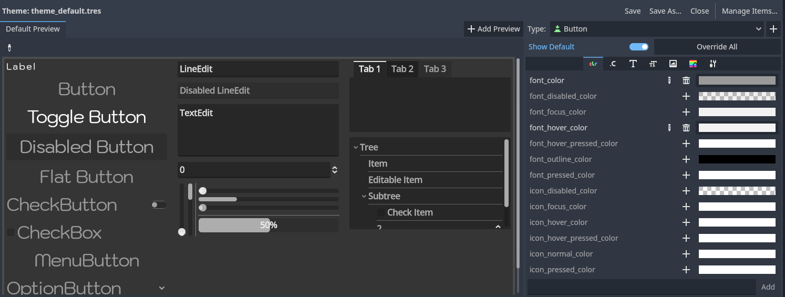
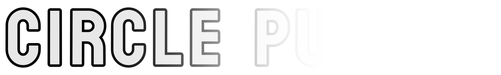

## The Result
Here is what I ended up with:


And here is the shader if you just want to copy paste it real quick ( you probably want to remove the `_circle_distances` stuff ):

<details open>
	<summary>
	Code
	</summary>

	```glsl
shader_type canvas_item;

uniform vec4 _color_base: source_color;
uniform vec4 _color_0: source_color = vec4(1.0, 1.0, 1.0, 1.0);
uniform vec4 _color_1: source_color = vec4(0.0, 0.0, 0.0, 1.0);
uniform float _border_size: hint_range(0.01, 0.5, 0.01);
uniform float _smoothness: hint_range(1.0, 2.5, 0.01);
uniform float _corner_radius: hint_range(0.0, 1.0, 0.01) = 0.6;
uniform float _aspect_ratio;
uniform float _circle_distances[2];


float box(vec2 position, vec2 halfSize, float cornerRadius) {
   position = abs(position) - halfSize + cornerRadius;
   return length(max(position, 0.0)) + min(max(position.x, position.y), 0.0) - cornerRadius;
}


void fragment() {
	float distance_normalised_0 = clamp(_circle_distances[0] / 4000.0, 0.0, 1.0);
	float distance_normalised_1 = clamp(_circle_distances[1] / 4000.0, 0.0, 1.0);

	vec2 uv_mod = UV;
    uv_mod.x = mix(0.5, uv_mod.x, _aspect_ratio);

    vec2 position = (2.0 * uv_mod - TEXTURE_PIXEL_SIZE);
    vec2 halfSize = vec2(_aspect_ratio - 0.1, 0.90);
	float cornerRadius = _corner_radius;
    // Calculate signed distance to the shape
    float d = box(position, halfSize, cornerRadius);

    // Apply smoothing
    d = smoothstep(_border_size, _border_size * _smoothness, abs(d));

	// Calculate gradient color based on distance
	vec3 gradient_color = mix(
		mix(_color_0.rgb, _color_base.rgb, distance_normalised_0),
		mix(_color_1.rgb, _color_base.rgb, distance_normalised_1),
		UV.x * 1.7);

    // Output final color
    COLOR = vec4(_color_base.rgb * gradient_color, 1.0 - d);
}
```
</details>

## Why a custom shader for a button border?
I wanted to add a simple gradient to my button border, turns out that is not as easy with the build in theme functionality as I was hoping for.



After looking into a couple of [creative ways](https://github.com/godotengine/godot-proposals/issues/2564#issuecomment-816572528) to work around the limitations, I decided to try a SDF Box shader.

## SDF - Signed Distance Functions
I will not go into the detailed maths of an SDF there are actual math masters out there I can link to.
The basics for this shader are here:
- [The SDF of a Box](https://youtu.be/62-pRVZuS5c?si=Nc1dVD0WpN8_HYBx)
- [Rounding Corners in SDFs](https://youtu.be/s5NGeUV2EyU?si=jRcvsfEfUj_0lg7m)

## The Process
Like most shader work ( that I do ) the journey begins by copy-pasting some [shadertoy code](https://www.shadertoy.com/view/Nlc3zf) into your canvas_item shader.

### Aspect Ratio
It didn't take to long to get the desired rounded border on the screen, as long as the `ColorRect` stayed quadratic.
The pain started as I tried to figure out how in the world I adapt the shader to the aspect ratio of the `ColorRect`.
Because I would argue most of the time a button will not be exactly quadratic.

I will keep it nice and short here is the answer:
"Pass the size of the color rect as a uniform to your shader" 🎉

You can do this by connecting to the `resized` signal of the control and doing something like this:

```php
func _on_color_rect_resized() -> void:
	color_rect.material.set_shader_parameter("_aspect_ratio", color_rect.size.x / color_rect.size.y)
```

Here is [a link to a proposal](https://github.com/godotengine/godot-proposals/issues/8274) to add a build-in way to obtain the aspect ratio of a control in a shader.

Now with the aspect ratio in the shader you can start putting it to the right numbers.   
For the box shader that would be here:
```glsl
vec2 uv_mod = UV;
// Mix the modulated UV.x coordinate with the aspect ratio.
uv_mod.x = mix(0.5, uv_mod.x, _aspect_ratio);
```

And here:
```glsl
vec2 halfSize = vec2(_aspect_ratio - 0.1, 0.90);
// The `- 0.1` is to keep some margin to the end of the TextureRect
// to not cut off the border. 
```

I would like to give a more detailed explanation of why they are used there, but if I'm totally honest, I just added it in logical places until it looked like what I wanted 😄

Then I proceeded to remove everything related to the animation and added uniforms so I could easily tweak everything from the editor.


### Gradient
Adding a gradient is pretty straightforward, just pass two colors as a uniform mix them based on `UV.x`, and multiply that with the base color.
```glsl
// Calculate gradient color based on distance
vec3 gradient_color = mix(_color_0.rgb,	_color_1.rgb, UV.x * 1.7);
// Output final color
COLOR = vec4(_color_base.rgb * gradient_color, 1.0 - d);
```

### Coloring based on the distance to the circles
Now that I have this fancy border shader I decided to also mix the gradient colors with the distance to each circle.

```glsl
// Calculate gradient color based on distance
vec3 gradient_color = mix(
	mix(_color_0.rgb, _color_base.rgb, distance_normalised_0),
	mix(_color_1.rgb, _color_base.rgb, distance_normalised_1),
	UV.x * 1.7
);
```

The distance is calculated in the title screen script and passed to all buttons ( and the title texture ).

```php
func _physics_process(delta: float) -> void:
	if RunData.current_circles.size() > 1 and visible:
		var btn_start: PanelContainer = button_start_single
		var distance_to_circle_0 = btn_start.global_position.distance_to(RunData.current_circles[0].circle_body.global_position)
		var distance_to_circle_1 = btn_start.global_position.distance_to(RunData.current_circles[1].circle_body.global_position)

		var circle_distances = [distance_to_circle_0, distance_to_circle_1]

		title_texture.material.set_shader_parameter("_circle_distances", circle_distances)
		button_start_single.color_rect.material.set_shader_parameter("_circle_distances", circle_distances)
		button_start_coop.color_rect.material.set_shader_parameter("_circle_distances", circle_distances)
		button_settings.color_rect.material.set_shader_parameter("_circle_distances", circle_distances)
		button_exit_game.color_rect.material.set_shader_parameter("_circle_distances", circle_distances)
```

Then I passed the colors of each circle to the shader, and now the buttons have a gradient between the two circle colors and the intensity is based on the distance to the button.


Done! The biggest hurdle was to figure out that you have to pass the size of the element via GDScript but now I know 😅 

## Title Texture
Just a quick side note, for the title I used a mask texture 



and this basic shader:
```glsl
shader_type canvas_item;

uniform sampler2D SCREEN_TEXTURE : hint_screen_texture, filter_linear_mipmap;

uniform vec3 _color_base: source_color = vec3(1.0, 1.0, 1.0);
uniform vec3 _color_0: source_color = vec3(1.0, 1.0, 1.0);
uniform vec3 _color_1: source_color = vec3(0.0, 0.0, 0.0);
uniform float _circle_distances[2];

void fragment() {
	float distance_normalised_0 = clamp(_circle_distances[0] / 4000.0, 0.0, 1.0);
	float distance_normalised_1 = clamp(_circle_distances[1] / 4000.0, 0.0, 1.0);

	vec4 mask_color = texture(TEXTURE, UV);
	vec4 screen_color = texture(SCREEN_TEXTURE, UV);
	vec3 mix_color = mix(
		mix(_color_0, _color_base, distance_normalised_0),
		mix(_color_1, _color_base, distance_normalised_1),
		mask_color.r);

	COLOR.rgb = mix_color;
	COLOR.a = mask_color.a;
}
```


## Quick recap
- Copied [SDF Shader from Shadertoy](https://www.shadertoy.com/view/Nlc3zf)
- Deleted all code that is unnecessary to display the rounded border
- Pass the aspect ratio as a uniform to the shader
- Use it to modulate `UV.x` and the `halfSize` of the box.
- Add a bunch of uniforms so it's easy to modify the shader from the editor
- Add a basic gradient by mixing two colors based on `UV.x`
- Profit 💰

## That's it!
If you have any questions, or you want to explain the details of my `aspect_ratio` math, you can find me on the [Godot Modding Discord](https://discord.godotmodding.com/) and ping me in **#dev** or on Twitter [@KANAjetzt](https://twitter.com/KANAjetzt) 👍
