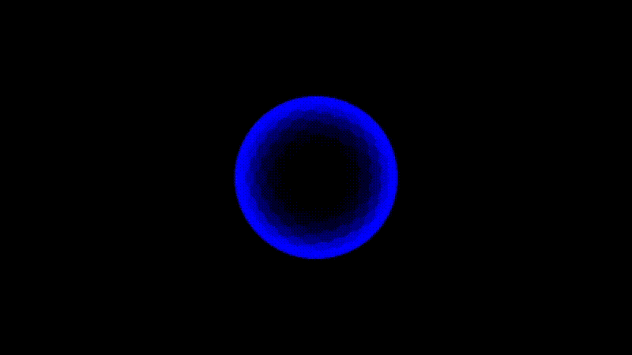
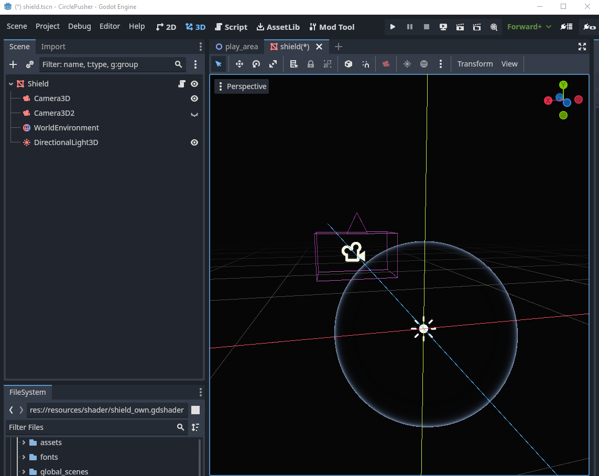
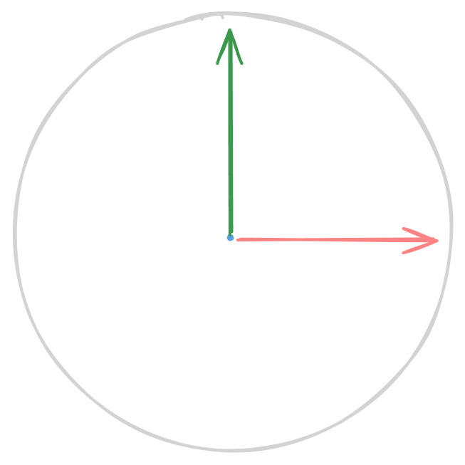

## The Result

Here is what I ended up with:


## The Process

I was hunting for a nice shader to spice up my arena boundary for Circle Pusher®. Browsing through [Godot Shaders](https://godotshaders.com/) brought me to [this page](https://godotshaders.com/shader/energy-shield-with-impact-effect/).

That looked promising:



One issue got clear pretty much immediately, I was looking at a 3D spatial shader and Circle Pusher® is a 2D top down game. But I didn’t worry to much about it, I wanted to try out some viewport shenanigans anyway, after watching [Raffa’s talks about them](https://youtu.be/cwZGq1qJYoQ?si=HHUEYWUh37eSCXhI).

So I did the good old copy paste and tried to set everything up in a new 3D Scene.

Easy enough just add a sphere, material and drop the shader there, voila a sphere with [Fresnel](https://de.wikipedia.org/wiki/Augustin_Fresnel).



One important detail for later, the circle is position with the center in the center of the scene and and the camera is pointing at the circle directly on the Z axes.



Now the interesting part, make it wobble and best case make it wobble where the little battle circles hit the border.
Out of the box the shader uses two curves to animate the impact and ripple effect.
I peaked at the [demo project](https://github.com/AbstractBorderStudio/energy-shield-shader-with-impact-effect) and translated it to GDScript, with that it wobbled at a fixed point 🎉 good start.

## Getting my bearings

Now how exactly do I get the position of the circle translated from the 2D space to the 3D space of the shield?

It took me a while and I went through some heavy design discussions with my friend Chat GPT.

But all that translate or ray cast stuff seemed a bit much for this case. So a good night of sleep brought me this simple solution:

![Drawing of two circles with a label on top: 2D over the left one and 3D over the right one. An arrow extends from the center of each circle pointing towards the outer boundary. A 0 is placed on top of the arrow at the center of both circles, and a 1 is positioned at the end of the arrow. Beneath the arrow, the distance is indicated as 0px from the left circle's center and 977px at the end of the arrow. For the right circle, the measurements are 0.0m at the center and 0.5m at the end of the arrow.](./drawing.png)

If you can make it 0 to 1 make it 0 to 1 😄

So here is the plan:

1. Get the distance to the circle from the center of the arena
   - Translate that to a 0 to 1 range
2. Get the direction to the circle from the center of the arena
3. Send this to the 3d scene
4. Translate the 0 to 1 range to the spheres 3D space
5. profit

As mentioned before it is important that the sphere is position correctly in the 3D scene. This setup allows me to just ignore the Z axes and always set it to 0.


I am pretty happy with that, what I don’t like is the stiff animation and the fact that it always looks the same. But what ever, I can tweak that later 👍

Time to make it work with multiple circles 🎉

## How many circles? Yes!

Things get a bit blurry from here, I had some discussions again with my friend Chat G., sadly we kept talking past each other. So I don’t know exactly how I ended up with that idea.

I started throwing out everything I didn’t want from the shader and started fiddling until I ended up with this:

```glsl
void vertex() {
	float displacement = 0.0;
	// Calculate the vertex position in world space
	vec3 vertex_world_position = (MODEL_MATRIX * vec4(VERTEX, 1.0)).xyz;

	for (int i = 0; i < _circle_global_positions.length(); i++) {
		vec3 circle_global_position = _circle_global_positions[i];

		// Calculate distance to circle
		float vertex_distance_to_circle = clamp(distance(vertex_world_position, circle_global_position), 0.0, 1.0) ;
		vec3 vertex_direction_to_circle = direction(vertex_world_position, circle_global_position);
		float vertex_dot_to_circle = dot(NORMAL * -1.0, vertex_direction_to_circle);

		displacement += (smoothstep(0.1, 0.0, vertex_distance_to_circle) * 0.025) * vertex_dot_to_circle;
	}

	VERTEX += NORMAL * (displacement + _shield_size);
}
```

That’s it, pretty simple and I’m sure it could be trimmed down or be optimized. But with this I actually solved two issues at once.

- Multiple circles can interact with the shield surface
- There is no fixed animation any more

## Quick explanation

- For each circle I
  - Get the distance from the current vertex to the circle
  - Get the direction from the current vertex to the circle
  - Get the dot product between the current vertex normal and the direction to the circle
  - Then I smoothstep between `0.1` and `0.0` based on the distance to the circle, the distance is clamped between `0` and `1` so the effect only happens if the vertex is close enough.
  - Then I just multiply this by a small value → `0.025` to tune down the displacement
  - Multiply it by the dot product calculated above - this will cause the displacement to reverse if the circles are outside the shield. Resulting in a nice wobbly effect.
- Then just multiply the commutative displacement with the vertex normal and add that to the vertex.

Here is the final product again:


## That's it!

If you have any questions, you can find me on the [Godot Modding Discord](https://discord.godotmodding.com/) and ping me in **#dev** or on Twitter [@KANAjetzt](https://twitter.com/KANAjetzt) 👍
