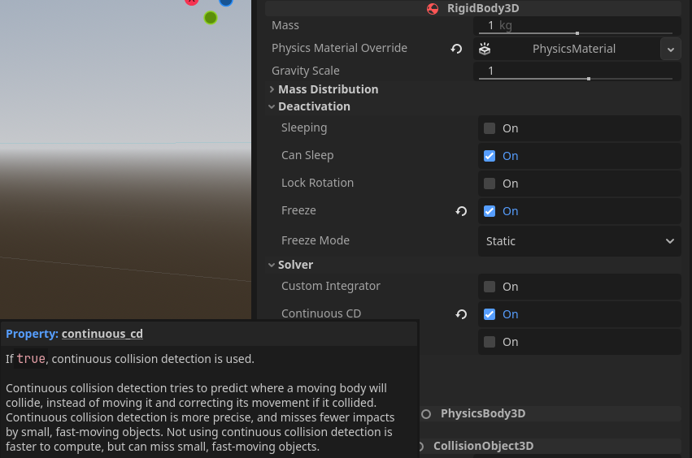
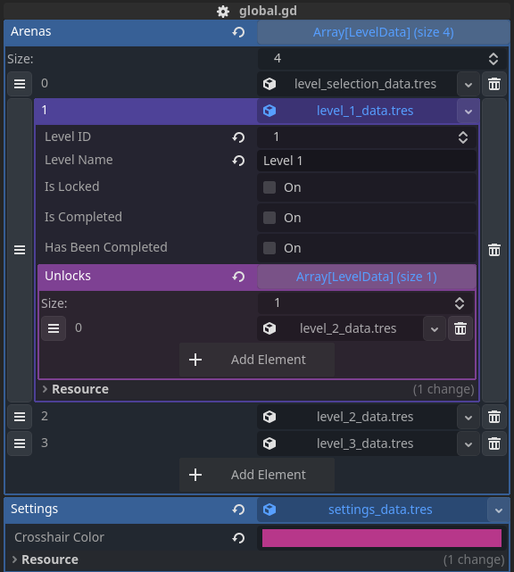
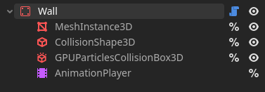
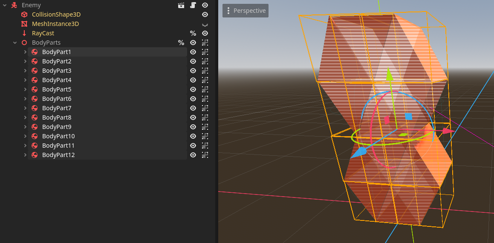

<script>
  import ItchEmbed from '$lib/components/ItchEmbed.svelte'
</script>

## The Game

_FlashIT is an action puzzle game set in cyberspace. You are the last line of defense against an army of evil AI bots. Use your special flash device to banish them from the digital realm. Be resourceful, be nimble, be quick._


<ItchEmbed button_text="Play it right here right now! (Depending on your hardware your browser might struggle a bit.)">
<iframe
    frameborder="0"
    src="https://itch.io/embed-upload/11150327?color=000000"
    allowfullscreen="true"
    width="688"
    height="450"><a href="https://kanamedia.itch.io/flashit">Play FlashIT on itch.io</a></iframe
  >
	<ul>
	<li>Make sure to toggle full screen at the bottom right corner.</li>
	<li>Click on the game and hit "L" on your keyboard to lock the mouse courser.</li>
	<li>Visit the itch page for more details</li>
	</ul>
	<iframe frameborder="0" src="https://itch.io/embed/2889560?dark=true" width="688" height="167"><a href="https://kanamedia.itch.io/flashit">FlashIT by KANAMedia</a></iframe>
</ItchEmbed>

## Day 1 - 29.07.2024

- Objects kept dropping through physics bodies, I had to enable Continuous CD on the Flash.

  

## Day 2 - 30.07.2024

- CSG does not work with Raycasts, so I can’t use them for gray boxing.
- Raycasts with normal Static Bodies are now working.
- Enemies and the player now register if they are flashed or if the flash is blocked by geometry.
- Added Level Selection with teleporters.
- Did some data management by adding LevelData and creating a Global Autoload, so I can store the `start_position` and `level_name` in one place and pass it around wherever I need it, for example, to the porter.

- Created a Base Level Template that the other levels can inherit from.


## Day 3 - 31.07.2024

- Added a second test level.
- Added a quick flash sound effect after figuring out how to download the SFX library I bought on Humble Bundle a while ago.
- Fiddled around with Reaper for a while to get [some plugins for sound modulation](https://www.meldaproduction.com/effects/free) to work.
- Added particles to the flash.
- Changed the World Environment to look darker and added fog.
- Added a custom flash model.
- Added a level complete state and level unlock.
- Added right-click to light throw the flash.


## Day 4 - 01.08.2024

- Disabling the depth test doesn’t work with transparent objects because [transparent objects skip the depth test](https://forum.godotengine.org/t/depth-test-fails-on-multimesh-rendering/46046). 
  - I changed the dissolve shader to discard the pixel instead of using the `ALPHA` channel.
- Experimented with shaders, looking for a good way to transition into a level.
- Learned that you can convert any material to a shader material.
- Added the X-Ray shader and dissolve shader.
- Also tested noise normal maps on the walls for some reason.


## Day 5 - 02.08.2024

- Fixed Test Levels 1 and 2.

  - I changed the parent node of all structures in the parent scene of the levels and broke them in the process. 😅
  - I created a new Wall Scene that includes everything I need from a structure in a level. I exported width, height, and depth and updated the size of the mesh and collision boxes with those values. (I should be able to use this even if I get a custom wall model.)

    

- Added [Phantom Camera](https://phantom-camera.dev/) for fancy camera transitions.
- Added “Player Area Walls” that block the player.
- Spent too much time fiddling with the shader for those walls 😄 I had a shield shader lying around that reacts to nearby objects, so I adapted it “real quick” to react to the flash.


## Day 6 - 03.08.2024

- Reworked the enemy.

  - Replaced the basic capsule with prisms that fall apart if the enemy is flashed.

  

- Levels are now added and removed from the scene based on the currently active one.
  ```python
  # level_data.gd
  # True if currently the active level
  @export var is_active := false :
      set(new_value):
          is_active = new_value
          if ref and not level_id == 0:
              if new_value == true:
                  Global.level_container.add_child(ref)
              else:
                  Global.level_container.remove_child.call_deferred(ref)
  ```
  ```python
  # global.gd
  var current_arena: LevelData :
      set(new_value):
          previous_arena = current_arena
          current_arena = new_value
          current_arena.is_active = true
  var current_arena_index := 0 :
      set(new_value):
          current_arena_index = new_value
          current_arena = arenas[new_value]
  var previous_arena: LevelData = null :
      set(new_value):
          previous_arena = new_value
          if previous_arena:
              previous_arena.is_active = false
  ```
- Added better camera transitions to Test Levels 2 and 3.


## Days 7 - 9 - 04.08 - 06.08.2024

### Day 7

- Had a good run on Sunday.
- Added flash cooking 🧑‍🍳 - the flash is now thrown once the button is released, so the player can “cook” the flash, allowing the detonation timer to increase and providing more flexibility in level design (I hope).
- Added a customizable flash count limit for each level.
- Disabled player input during camera transitions.
- Added HUD with:
  - Remaining flash count
  - Remaining enemies
  - Level time
  - Game time
- Added a settings menu (feels a bit out of scope, but anyway 😅).
- Added a skip camera transition action.

My plan was to enter feature freeze on Sunday so I have a week to focus on content, sound, and polish. However, I didn’t manage to add scoring in time, so I will have to postpone that.

### Day 8

It's Monday 🙃 After a long day at the office, I didn't have much energy left to work on stuff, so all I did was set up the scaffolding for the scoring system.

- Added all required variables to hold the score data:
  - Score for enemies flashed
  - Score for level time
  - Score for flashes used
- Added a global Resource to hold the points rewarded for each of these types.

### Day 9

A bit more energy on Tuesday allowed me to complete the scoring system.

- Wired up the scoring system and fixed all bugs I created in the process (hopefully).
- Also added a setting for displaying the Level and Game Time on the HUD.
- Played around with some post processing shaders


## Day 10 - 07.08.2024

Not quite as planned, it looks like I spent all day displaying the scores on screen 😶‍🌫️

- Score is now displayed when an enemy is flashed.
  - Currently, many points are still given at the end of a level, so I need to figure out how to display them without cluttering the screen. I will keep it as is for now, because sound, visuals, and levels are a higher priority at the moment.


## Day 11 - 08.08.2024

I really need to focus on finding a style for the game now. Maybe I should just keep the prototyping textures and write some lore around them 😄

- Discovered [complex emission shapes in Godot](https://docs.godotengine.org/en/stable/tutorials/3d/particles/complex_shapes.html) and used them to create volumetric particle walls.
- Had some trouble getting the scaling of the emission shape right.
  - There was a translation on the mesh I used to generate the emission shape that messed up the scaling. Resetting it to 0 and then generating the emission shape fixed the issue.
- Experienced major performance issues with transparent surfaces, but only if that surface covers the entire screen.
  - Initially, I thought the particles were the problem, but it turns out Godot sometimes struggles with transparent surfaces 🤔
  - I don’t have a proper fix for this yet. For now, using an unshaded material works.


## Day 12 - 09.08.2024

Had a lot of work for work to do, so there was little time to focus on the game.

- Managed to come up with a style that works with the new particle walls.
  - Realized that particles alone might make it hard to find "fix spots" to align flashes.
- Started working on some ambient sounds.
- Oh, I also added test level four. Not sure if that happened today or yesterday 😄


## Day 13 - 10.08.2024

Had the final push today. Started working early, took a nice long outdoor break, and then accidentally worked through until morning.

- **Sound:**
  - Implemented ambient sounds
  - Added sound effects for:
    - Portal
    - Enemy explosion
    - Level completion
    - Reworked the flash explosion sound
- **UI:**
  - Created and added icons for:
    - Remaining flash counter
    - Remaining enemy counter
    - Score
    - Game Time
    - Level Time
  - Added 3D labels above the portals to display the final level score and time
  - Added 3D labels to display the current and previous game time and score
- **Visuals:**
  - Replaced the prototype material with unlit particle volumes used for the walls
  - Used the same particle style to rework the player character
    - Did some additional tweaking to hide and show the particles once the camera is in first person
- **Point System:**
  - Fixed a lot of bad math and bugs in the point system. I heavily underestimated the work required for this feature. Next time, I would skip it and just be content with the time trial aspect.
  - Added the missing text displays for the time and flashes used score.
- **Game Restart:**
  - Made it possible to rerun the game
	- Added ~~messy~~ *time-efficient* code to restart the game while keeping some level data for each run 
	- Added a new green portal type that shows up once the game is completed to start again

- **Exporting the Game:**
  - I knew I might wake some dragons here because I chose to use [Godot Jolt](https://github.com/godot-jolt/godot-jolt) as the physics engine, which doesn't support web builds currently. However, there is a [pending PR](https://github.com/godot-jolt/godot-jolt/pull/902) that enables this.
  - It works really well (at least for me). I grabbed the zip mentioned in [the PR](https://github.com/godot-jolt/godot-jolt/pull/902), copied it over the Jolt addon, enabled GDExtensions in the Export settings, and done 👌

I think that’s everything I did. Submitted two hours before the deadline, and everything seems to be working at the moment 👀

