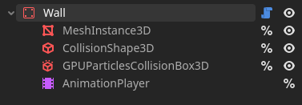
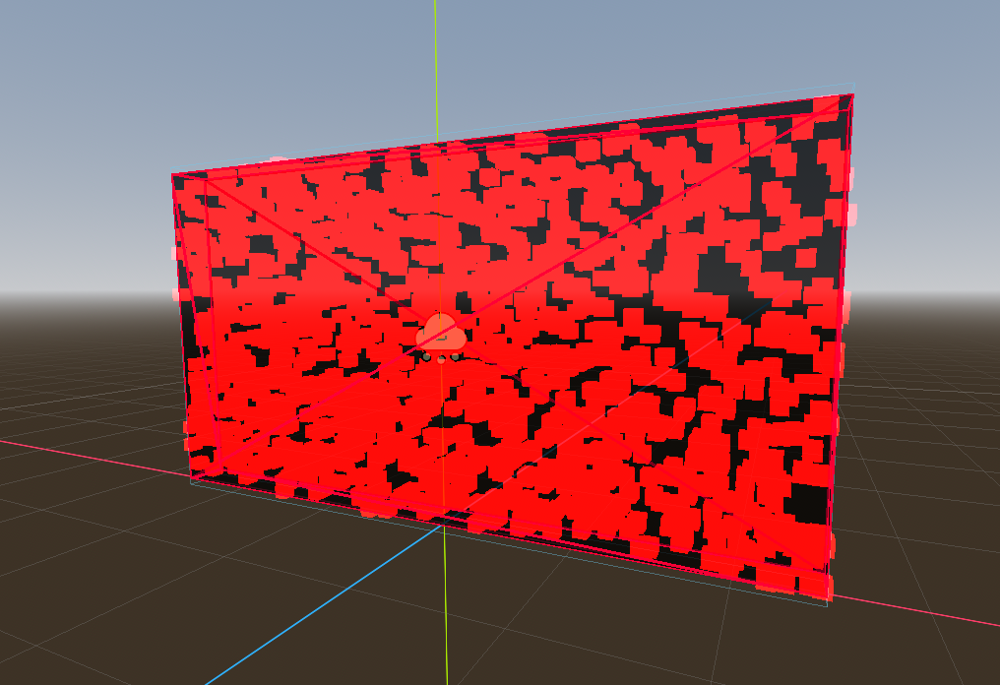

## The Game

Imagine you are in an elevator with a random person, and they tell you:

> FlashIT is an action puzzle game set in cyberspace. You are the last line of defense against an army of evil AI bots. Use your special flash device to banish them from the digital realm. Be resourceful, be nimble, be quick.

What picture would this evoke in your mind? Would you leave the elevator on the next floor?

Now, here is what I came up with after two weeks of game jamming at [**My First Game Jam 2024**](https://itch.io/jam/my-first-game-jam-2024).

<ItchEmbed button_text="Play it right here right now! (Depending on your hardware your browser might struggle a bit.)">
<iframe
    frameborder="0"
    src="https://itch.io/embed-upload/11150327?color=000000"
    allowfullscreen="true"
    width="688"
    height="450"><a href="https://kanamedia.itch.io/flashit">Play FlashIT on itch.io</a></iframe
  >
	<ul>
	<li>Make sure to toggle full screen at the bottom right corner.</li>
	<li>Click on the game and hit "L" on your keyboard to lock the mouse courser.</li>
	<li>Visit the itch page for more details</li>
	</ul>
	<iframe frameborder="0" src="https://itch.io/embed/2889560?dark=true" width="688" height="167"><a href="https://kanamedia.itch.io/flashit">FlashIT by KANAMedia</a></iframe>
</ItchEmbed>

## The Idea

We spent the first two days brainstorming ideas. The jam came with the optional theme: ☀️ Light ☀️

Here are some highlights:

- Weak golfing
- Puzzle game where you have to flash all your teammates
- A person (or all people) lighter than air, so everyone is just floating around
- Light bulb with burnout

Guess which one made the cut.

## Puzzle game where you have to flash all your teammates

I tried really hard to avoid building a straight-up puzzle game because I thought it would be way too hard to design fun puzzles. But for unknown reasons we chose this idea over all the deep and thoughtful ones 😄

We actually created a small [Game Design Doc](https://www.nuclino.com/articles/game-design-document-template) in the hope of keeping us focused.

Here are the game mechanics we wrote down for that and what we ended up with:

- **Fixed Player Position:** The player cannot move from their starting position in the arena. They can rotate and aim freely within their view.
  - Instead of not allowing the player to move, we restricted the player to a predefined area. The player can jump and move around while throwing, allowing for more variety in approaching a level.
- **Flash Grenade:** The primary tool, with one use per level.
  - It is the primary tool, and that’s why the default amount per level is variable now 😄
- **Teammate Visibility:** Some teammates are hidden from direct sight, requiring players to use the mini-map and environment to reach them.
  - Well, the teammate part fully went away because it’s a lot easier to explain the premise of destroying your enemies than your teammates (at least for people who haven’t played competitive shooters with flashes). The enemies are almost always behind cover, so we got that part covered. The mini-map didn’t make it, but the enemies can be seen through walls.
- **Throw Mechanic:** Physics-based, allowing for strategic bounces and throws. The player must consider angles and surfaces to reach out-of-sight teammates.
  - I added an additional light throw and the option to "cook" the flash by holding the mouse button.
- **Arena Design:** Includes walls and other objects that influence the flash's trajectory and spread.
  - The levels currently in the game are very simple. I think a lot more can be done where the flash has to bounce on multiple walls to hit the desired spot.
  - We ended up with a single wall prop that can be modified in size. Turns out you can build a lot of things with a rectangle 😄 Maybe in a later stage of the game, some rounded surfaces would be nice, but for the jam purposes, the rectangle does the job.
    
    
- **Scoring System:** Points awarded based on the number of throws, time taken, and any additional objectives.
  - Made it in. But I’m not sure if it was worth it. I spend two days adding it into the game.
- **Levels:** A progression system with gradually increasing difficulty.
  - I added a simple system to lock and unlock levels, but it wasn’t used in the jam because I didn’t want to block anyone from trying all levels. In a more developed version I can see blocking of chunks of levels based on a global score.

## Building the Game

You can check out the full dev log with progress GIFs here ➡️

### Week 1

The first two days were spent in the concept phase, building out ideas. After deciding on the flashing game, I started by creating my to-dos for the prototype. I use Notion and just start adding things I already know I need (assets, SFX, systems I have to code). I don’t go into great detail with that list. I just want a general overview at the start. Once I tackle a point, I add more details. Added FP Controls, the flash, and the first 3 levels. My plan was to have a feature-complete MVP so I could spend the second week fully working on polish, visuals, and sound.

### Week 2

It turns out building a point system can be quite a heavy task, so I kept coding for two additional days before I was able to focus on visuals. On day 11, I started working on the cyberpunk/cyberspace and added a lot of [particle volumes](https://docs.godotengine.org/en/stable/tutorials/3d/particles/complex_shapes.html) in the process. The last two days I spend on ambience, SFX, UI icons, scoreboard, game restart.

## Looking Back at It

Now, a good week after the jam, I’m very happy with what we accomplished. There were no major scope missteps like in [my last submission](https://kanamedia.itch.io/circle-pusher) for MFGJ-23. So we were able to produce a complete package.

### Things That Worked Out:

- Made some early reasonable scope decisions like:
  - Enemies don’t move
  - Player is heavily restricted in the play area
  - Only one key gameplay system
- Also, a level-based structure is great because they are naturally decoupled. That allows, in theory, for multiple people to work on different levels, and levels can just be added or left out based on time constraints without the whole game breaking apart.

### Things to Improve on the Next Run:

- Focus on the core gameplay loop more, and add fluff later or cut it.
  - Like the point system
- Think about visual style and theme earlier.
  - The art direction and theme came in pretty hot, so there was not much time to refine them.
- The plan to enter feature freeze after week 1 is a good one, so try to reach that goal next time 🤞

## After Jam Updates

I have lot's of ideas:

- Level replay system
- Flash follow cam
- Extra points for hitting enemies directly
- Modulation areas:
  - Area where the flash detonation timer is increased or decreased
  - Area where the flash explodes instantly
  - Area where the flash is duplicated

Also, playtest feedback:

- Make level completion more clear.
  - Maybe by adding a level complete camera transition (could get annoying), or by changing the exit portal colors. Even toggling the portal based on flash and enemy count would be something.
- Add a top view or mini-map to give the player a better overview of the level.

So, lots of stuff that could be done, but I’m currently still working on my previous submitted game, [Circle Pusher](https://kanamedia.itch.io/circle-pusher) and I’m more excited about couch co-op or multiplayer shenanigans than single-player puzzles. Even if the open points sound fun to work on!

## That’s It!

If you have any questions, you can find me on Twitter [**@KANAjetzt**](https://twitter.com/KANAjetzt) 👍
