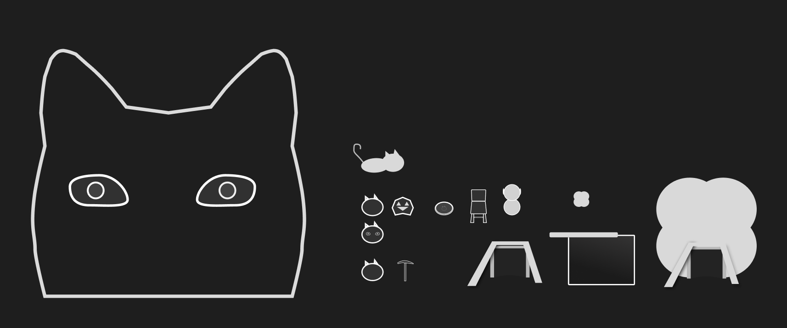
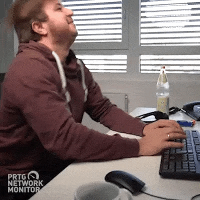
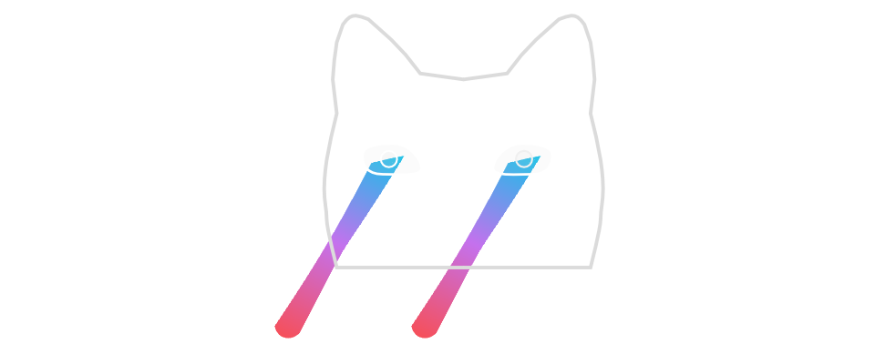

## The Game

I like to start with a look at the final result, so here is a quick snippet of gameplay.

The issues are already pretty visible in this clip, but I will come back to them in a bit 😄

If you want to experience this high-octane gameplay yourself, hop over to [the itch page](https://kanamedia.itch.io/ld55-defender-cats)!

## The Jam

I joined the little niche game jam called [Ludum Dare](https://ldjam.com/events/ludum-dare/55), it is actually the 55th time the event is held, and the theme was **Summoning.** My original plan was to compete in the compo format where you have to do everything yourself (not a big issue if you have no team 🥲) and from scratch (game engines are allowed but all assets etc.) in 48 hours. For me, the jam starts at 3 a.m. on Saturday. I knew I will have very little or no time on my PC on Saturday, so I had a whole day to come up with a great idea while I rip and tear the chimney out of my house 😄

## The Idea

I woke up early on Saturday to get at least an hour of PC time in before leaving. With the fact of only having one day to implement everything in my mind (totally not), I started typing the following ideas:

- Summon Cats with Food and Other Things
  - Cats get summoned by dropping food in their bowl
- Cats Sit in the Way
  - Cats get summoned in front of you if you carry something heavy in a narrow space
- Avoid Getting Summoned
  - You are a demon and just want to continue sleeping

I can definitely tell that I just converted the experience of the first few minutes after waking up to these great ideas 😄

So I left and had the entire rest of the day to build on them.

## The Concept

Somehow my brain almost immediately discarded the "Cats sit in the way" and "avoid getting summoned" ideas, so I just kept building on the first one.

At the end of the day, I had the following bullet points I wanted to implement:

- Dry food mine -> click to receive food
  - Recruit “miners” to automate that process
- Place chairs where people try to stand up from to summon a cat in their lap
  - 10 sec until the cat stands up and becomes a warrior
  - Once the cat has been summoned, the person wanders off-screen
- Food is poured into the bowl to summon a miner cat
- Cats fight against aliens
- Aliens drop dry food
- Aliens want to steal the dry food mine
- Cats shoot lasers from their eyes at the Aliens
- Aliens only try to reach the mine (they don’t attack)
- Maybe a summoning phase and a defending phase?
  - No just increase the amount of Aliens attacking over time
- Dry food is the score
- There is storage for it the aliens try to reach (?) (Maybe it’s better to space out so you have to increase the territory)
- Or the aliens just attack the next best thing but then everything needs to be destroyable 🤔
- Or aliens attack mines and the storage!
- Mines don’t have to deplete because the player wants to expand to get a higher score
- Start with 2-3 miners

What a solid game design, what could go wrong?

## The Process

### Sunday 7 a.m.

Let’s go!

I started by setting up a general to-do list for all assets that I need: art, SFX, music. Then I jumped into Figma and created these masterpieces.

### Sunday 9 a.m.

Now with the art ready, I created my coding to-dos and started hacking away.

### Sunday 11 a.m.

Solid start. I got every entity and building set up and was ready to implement the mining.

Quick breakfast and more hacking.

Oh, and here is a clip of me breaking the camera movement and debugging it with a giant piece of dry food:

### Sunday 3 p.m.

Ok, I got them moving, but something doesn’t seem right.

Time for a break. The weather is nice, so let's take the bike for a spin.

### Sunday 5 p.m.

Oh look, I found the issue.

This is the mining timer that starts once the miner enters a mine, so as soon as they entered the mine, they got a piece of dry food every second and felt the need to bring it back to the storage.

### Sunday 6 p.m.

Ok, mining is kind of working now, they still get sometimes stuck, but whatever, I can fix that later. Time to get some food.

### Sunday 8 p.m.

Sooo let's take a look at the to-do list.. Ohh. Ok, it got to me during the time when I got stuck on the timer issue that there is no way I will get this out in the COMPO time, so I already was prepared to move to the JAM where I had a full 24 hours of additional time to work with 🤯

At this moment, all I have is 3 cat-like blobs walking to a mine waiting there for a couple of seconds and moving back to the storage. Oh, and this animation:

Not much more happened this day, I was able to improve the miner behavior by adding a targeted counter to the mines, so the miners stopped racing each other to the closest mine.
That leaves:

- Aliens
- Warriors
- Fighting
- Altars (and with that spawning Miner and Warrior Cats)
- SFX
- Music
- Page Publishing

No problem. Except I have to spend 8 to 9 hours working on Mondays.

### Monday 7 p.m.

Ok, so I survived the day in the office, got some food in my body, rocking a bit of a headache, but nothing an energy drink and some painkillers can’t fix.

### Tuesday 3 a.m.

Wow ok, what just happened? It’s a mess but somehow I managed to get everything in. As is tradition in my jam games, I spend 30 minutes on sound effects and 15 minutes on creating _music._ Had no time for proper playtesting and just prayed that the export and upload will work. Just slammed everything up on itch and called it a day.

## The Good

- I’m very happy that I managed to get anything somewhat playable out for the jam, and it feels like a big step up from [my first entry](https://kanamedia.itch.io/the-box).
- I really got into a flow on Monday that allowed me to pump out all the missing pieces. If I had time to get started on Saturday I might have managed to put out a solid game during the Jam time.
- The art is definitely something I want to do in the next game jams, the highly lo-fi vector art leaves a lot to the imagination of the player without looking distractingly bad. I just have to focus on making it remotely recognizable.

- Spending the first 1 to 2 hours just throwing around ideas and thinking about all assets and programming that has to be done for each is a good start.
- Also, a rough plan with to-dos for the chosen idea is very useful to not get lost during the deep coding phase. Always knowing what to do next is a massive time saver.

## The Bad

- Scope - as always it’s a constant battle no matter how manageable something seems always multiply 2 to 3 times the time on top. This also means some ideas just can’t be done in a COMPO (depending on the skill level). I should have probably thrown away the idea I went with just based on all the parts I needed to get the game working.
- Getting stuck on stupid stuff, I think working at least with one other person can help mitigate something like the `Timer` problem. Maybe I manage to find someone stupid enough to join a team next time 😄

## The After Jam Game Plan

The Game has some very obvious issues even for a little jam game.

### Winning the Game

Adding a way to win the game would have mitigated the risk of a defender game where it’s totally possible that the player just can’t lose. So adding maybe some mother ships for the aliens that have to be destroyed, or a final boss wave would have been great to not leave players guessing if the game is finished or not.

### Exploration

I added a couple of alien clusters between mines, which attack the closest mine to them if a warrior approaches. The issue is the player has no incentive to move the warriors anywhere but around the storage to defend that.  
If I continue this project I would probably add some fog of war, that has to be cleared off by the warriors, so the miners only move to mines that have been cleared. Maybe the aliens then also attack the warriors instead of the mines (the aliens hide in the mine!) so there is a risk of losing them. I would love some outpost or upgrades that are hidden in the fog, so the player is not only incentivized to explore to expand the economy but also some fun roguelike upgrades for mining speed / movement speed / fire rate.

## The Conclusion

I really enjoyed my time working on this and will be back on it probably the next jam will be [MFGJ 24](https://myfirstgamejam.tumblr.com/). There is just something magical about starting with a blank page and having something playable after a short amount of time.  
Regarding the future of **[Summoner's Cat Defense](https://kanamedia.itch.io/ld55-defender-cats),** I will most likely leave it as is. I currently want to focus on getting [the Mod Loader](https://github.com/GodotModding/godot-mod-loader) to work with Godot 4 and getting [Circle Pusher](https://kanamedia.itch.io/circle-pusher) done.

## That's it!

If you have any questions you can find me on the [Godot Modding Discord](https://discord.godotmodding.com/) and ping me in **#dev** or on Twitter [@KANAjetzt](https://twitter.com/KANAjetzt) 👍
